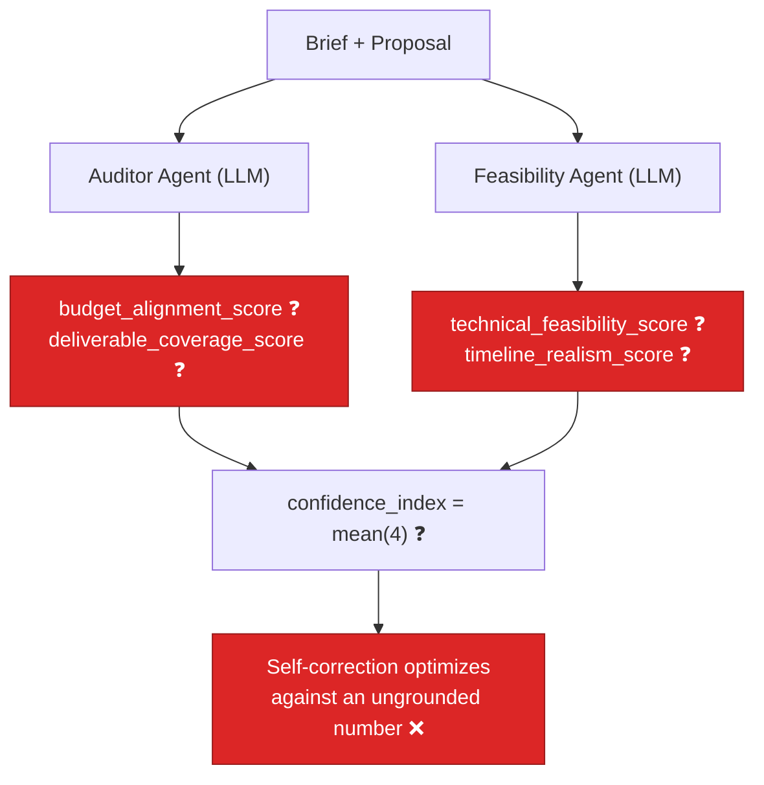

# AIE-09 — Confidence Grid Scores Come Straight From the LLM (No Deterministic Grounding)

> **Role**: AI Engineer · **Priority**: 🔴 Critical · **Effort**: ~2.5 days
> **Status**: 🔴 Not started. All four grid sub-scores are free-form LLM outputs in [confidence_grid.py](../../../ai-service/app/features/confidence_grid.py); the confidence index is just their mean.

---

## Story Identity

| Field | Value |
|:---|:---|
| **Story ID** | `AIE-09` |
| **Owner** | AI Engineer |
| **Files** | `ai-service/app/features/confidence_grid.py`, `ai-service/app/schemas/confidence.py`, `ai-service/app/config.py` |
| **Depends on** | AIE-03 (regression guard — done), AIA-06 (telemetry — done) |
| **Reference pattern** | [`opportunity.py`](../../../ai-service/app/features/opportunity.py) — deterministic weighted scorer |

---

## 1. Current Problem

The "Confidence Grid" is the platform's trust signal for a generated proposal ("zero-noise shortlist", "trust-first hiring"). Today it is **not a grid of measured factors** — it is four numbers the LLM invents on request, then averaged.

```python
# confidence_grid.py — the auditor/feasibility agents are asked to emit raw scores
AUDITOR_PROMPT = "... Provide a numeric score (0-100) for each ..."
FEASIBILITY_PROMPT = "... Provide a numeric score (0-100) for each ..."

confidence_index = round(
    (auditor_eval.budget_alignment_score
     + auditor_eval.deliverable_coverage_score
     + feasibility_eval.technical_feasibility_score
     + feasibility_eval.timeline_realism_score) / 4
)
```

Every one of these four dimensions is **directly computable** from the brief and the proposal, yet none of them is computed:

| Grid factor | What it *should* measure | What actually happens today |
|:---|:---|:---|
| **Budget alignment** | Parsed brief budget vs. summed proposal effort/feature cost | LLM guesses a number |
| **Deliverable coverage** | % of brief-requested deliverables present in `features` / `timeline` / `delivery_plan` | LLM guesses a number |
| **Timeline realism** | Week math: phase durations vs. `delivery_plan.weeks`, dependency cycles, task/week density | LLM guesses a number |
| **Technical feasibility** | Stack coherence, complexity vs. duration ratios, risk severity coverage | LLM guesses a number |

Because the score is ungrounded, it is **non-reproducible** (same inputs → different scores across runs), **non-explainable** (no factor can be traced to evidence), and **gameable** (prompt phrasing moves the number). The self-correction loop then optimizes against this noisy signal, so cycles can "improve" a score that never measured anything real.



---

## 2. Why It Matters

- **Trust is the product.** The confidence index is surfaced to clients as the reason to trust a shortlist. A fabricated number quietly undermines the core UVP.
- **Reproducibility & audit.** Deterministic factors give the same score for the same inputs and let the UI show *why* (e.g. "3 of 5 requested deliverables covered"). The current schema (`AuditorEvaluation.findings`) promises evidence it cannot ground.
- **Better self-correction.** Optimizing against measured coverage/timeline signals produces real improvements, not prompt drift. It also lets the loop stop deterministically.
- **Consistency with the codebase.** `opportunity.py`, `skill_gap.py`, and `growth.py` already follow "deterministic math + LLM only for phrasing." The confidence grid is the outlier.

---

## 3. Step-Wise Solution

The goal is a **hybrid score**: deterministic sub-scores carry the weight; the LLM contributes bounded qualitative judgment and human-readable findings — it never emits the headline number.

### Step 3.1 — Deterministic factor functions (pure, testable)
Add a `scoring.py` (or a `deterministic_factors()` block in `confidence_grid.py`) with pure functions, each returning `0-100` plus evidence:

- `score_deliverable_coverage(brief_text, proposal)` — extract requested deliverables/features from the brief (reuse `skill_gap.extract_required_skills` tokenization + noun-phrase heuristics), match against `proposal.features[].title/description` and `delivery_plan` deliverables; coverage % = matched / requested.
- `score_timeline_realism(proposal)` — validate `timeline` phase durations against `delivery_plan.weeks` (`startWeek`/`endWeek` continuity, no gaps/overlaps), detect dependency cycles, and check task-per-week density is within sane bounds.
- `score_budget_alignment(brief_text, proposal)` — parse budget figures from the brief (regex for currency/number); compare against summed `effort[].percentage` weighting and feature complexity mix; if no budget stated, return a neutral `null`/`None` factor (excluded from the mean, not defaulted to a guess).
- `score_technical_feasibility(proposal)` — heuristic on complexity-vs-duration ratios, presence of mitigations for high-severity `risks`, and stack coherence.

### Step 3.2 — LLM contributes a bounded qualitative adjustment, not the score
Keep the auditor/feasibility agents, but change their contract: they return `issues[]`, `findings`, and a **qualitative modifier** in a small bounded range (e.g. `-15..+15`) that nudges the deterministic base — never the absolute score. This preserves LLM insight (spotting a subtle infeasibility) while anchoring the number to evidence.

### Step 3.3 — Blend deterministically
```
factor_final = clamp(0, 100, deterministic_base + llm_modifier)
confidence_index = weighted_mean(available_factors)   # skip factors that are None (e.g. no budget)
```
Make the weights explicit config (`CONFIDENCE_WEIGHTS`) so the blend is tunable and documented, mirroring `opportunity.score_opportunity`'s weight table.

### Step 3.4 — Expose factor evidence in the schema
Extend `AuditorEvaluation` / `FeasibilityEvaluation` (or add a `FactorScore` sub-model) to carry `{score, deterministic_base, llm_modifier, evidence[]}` so the UI and audit trail can explain the number. This mirrors `OpportunityScore.factors`.

### Step 3.5 — Fallback stays honest
When the LLM fails, fall back to the **deterministic-only** score (not the current flat `70`). A grounded partial score beats a fabricated round number and matches the AIE-02 "honest fallback" philosophy.

---

## 4. Done When

- [ ] Each of the four grid factors has a pure, unit-tested deterministic function returning a score + evidence.
- [ ] The LLM agents return `issues`/`findings`/bounded modifier only — they cannot emit the headline `confidence_index`.
- [ ] `confidence_index` is a documented weighted blend; factors with no evidence (e.g. no stated budget) are excluded, not defaulted.
- [ ] Same `(brief, proposal)` inputs produce the **same** confidence index across runs (determinism test).
- [ ] Factor evidence is present in the response schema and surfaced for audit.
- [ ] LLM-failure fallback returns the deterministic-only score, not a flat constant.
- [ ] Unit tests cover: full coverage vs. partial coverage, timeline gap/overlap/cycle detection, missing-budget neutrality, and determinism.
- [ ] `python -m compileall app` passes cleanly.

---

## 5. Cross-References

| Document | Relevance |
|:---|:---|
| [confidence_grid.py](../../../ai-service/app/features/confidence_grid.py) | The loop and the four ungrounded scores |
| [confidence.py](../../../ai-service/app/schemas/confidence.py) | Evaluation schemas to extend with evidence |
| [opportunity.py](../../../ai-service/app/features/opportunity.py) | Reference deterministic weighted scorer to mirror |
| [skill_gap.py](../../../ai-service/app/features/skill_gap.py) | Tokenization/coverage logic to reuse for deliverable matching |
| [AIE-03](../../specifications/ai_features/stories/AIE-03-confidence-grid-regression-guard.md) | Regression guard the loop already uses |
| [AIE-10](./AIE-10-brief-parser-ungrounded-confidence.md) | Sibling: fabricated numbers in the brief parser |
