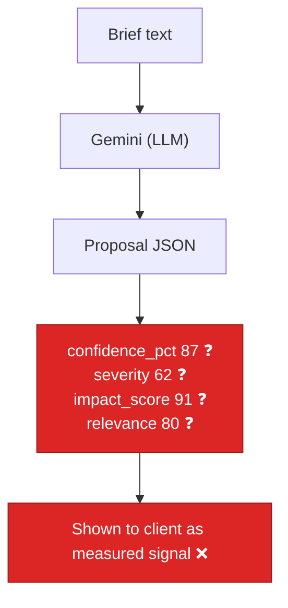

# AIE-10 — Brief Parser Emits Ungrounded Confidence / Severity / Impact Numbers

> **Role**: AI Engineer · **Priority**: 🟡 High · **Effort**: ~1.5 days
> **Status**: 🔴 Not started. `confidence_pct`, `risk.severity`, `impact_score`, `market.relevance` are LLM-fabricated in [brief_parser.py](../../../ai-service/app/features/brief_parser.py).

---

## Story Identity

| Field | Value |
|:---|:---|
| **Story ID** | `AIE-10` |
| **Owner** | AI Engineer |
| **Files** | `ai-service/app/features/brief_parser.py`, `ai-service/app/schemas/proposal.py` |
| **Depends on** | None (complements AIE-09) |

---

## 1. Current Problem

`parse_brief()` asks Gemini to produce a full `Proposal`, and the system prompt explicitly instructs it to **invent numeric confidences**:

```python
# brief_parser.py — SYSTEM_PROMPT
# "2. Formulate realistic confidence indices and identify crucial development complexity cards."
```

The `Proposal` schema then carries several numeric fields that are shown to users as if they were measured, but are purely LLM guesses:

| Field | Schema | Reality today |
|:---|:---|:---|
| `feature.confidence_pct` (0-100) | `proposal.py::Feature` | LLM makes up a percentage per feature |
| `feature.confidence` (High/Med/Low) | `proposal.py::Feature` | LLM label, unrelated to `confidence_pct` |
| `risk.severity` (0-100) | `proposal.py::Risk` | LLM makes up a severity |
| `impact.impact_score` (0-100) | `proposal.py::ImpactItem` | LLM makes up an impact score |
| `market.relevance` (0-100) | `proposal.py::MarketItem` | LLM makes up a relevance score |

These numbers look precise (e.g. "confidence 87%") but have **no basis** — they change run to run, don't correlate with the `complexity` label or the timeline, and can't be explained. The fallback path (`sanitize_and_patch_brief`) hard-codes equally arbitrary defaults (`confidence_pct: 75/90`, `severity: 45/50`, `relevance: 80`, `impact_score: 85`).



---

## 2. Why It Matters

- **False precision erodes trust.** A fabricated "87%" is worse than an honest qualitative band, because it implies a measurement that never happened.
- **Internal inconsistency.** `feature.confidence` (label) and `feature.confidence_pct` (number) are produced independently and routinely disagree; `severity` doesn't track the risk's `category` or the proposal's mitigations.
- **Feeds AIE-09.** The confidence grid's deliverable/feasibility factors can reuse a *grounded* per-feature confidence, so fixing the source improves the downstream grid.

---

## 3. Step-Wise Solution

The LLM should extract **qualitative, defensible** signals (complexity band, risk category, whether a mitigation exists); numeric derivations should be **deterministic** from those signals plus proposal structure.

### Step 3.1 — Derive `confidence_pct` deterministically
Compute per-feature confidence from grounded inputs instead of asking the LLM: map `complexity` (High/Med/Low) to a base, adjust for whether the feature has a concrete `technical_approach`, appears in the `delivery_plan`, and has dependencies resolved. Keep the LLM's `complexity` and `confidence` *label*; compute the *number*. Document the mapping.

### Step 3.2 — Derive `risk.severity` from category + mitigation
Score severity from a category weight table × presence/strength of `mitigation` (a risk with no mitigation scores higher). Deterministic and explainable.

### Step 3.3 — Ground or demote `impact_score` / `market.relevance`
These are advisory. Either (a) derive `impact_score` from `category` + linkage to features, or (b) if they cannot be grounded, demote them to qualitative bands (`high`/`medium`/`low`) in the schema so the UI stops implying precision. Pick one and apply consistently.

### Step 3.4 — Stop instructing the LLM to invent numbers
Remove "Formulate realistic confidence indices" from `SYSTEM_PROMPT`; instruct it to output only qualitative fields. Have the service compute numerics post-parse (both on the LLM path and the fallback path, so both are consistent).

### Step 3.5 — Fallback uses the same derivation
`sanitize_and_patch_brief` should call the same deterministic derivation rather than hard-coding `75/90/45/80/85`, so LLM and fallback proposals score identically for identical structure.

---

## 4. Done When

- [ ] `confidence_pct`, `risk.severity` (and `impact_score`/`relevance` per Step 3.3) are computed deterministically from grounded fields, not emitted by the LLM.
- [ ] `SYSTEM_PROMPT` no longer asks the model to invent numeric confidences.
- [ ] The LLM path and the `sanitize_and_patch_brief` fallback path use the **same** derivation (identical structure → identical numbers).
- [ ] `feature.confidence` (label) and `feature.confidence_pct` (number) are consistent by construction.
- [ ] Unit tests cover the derivation (complexity→confidence, mitigation→severity) and LLM/fallback parity.
- [ ] `python -m compileall app` passes cleanly.

---

## 5. Cross-References

| Document | Relevance |
|:---|:---|
| [brief_parser.py](../../../ai-service/app/features/brief_parser.py) | `parse_brief` + `sanitize_and_patch_brief` |
| [proposal.py](../../../ai-service/app/schemas/proposal.py) | `Feature`, `Risk`, `ImpactItem`, `MarketItem` fields |
| [AIE-09](./AIE-09-confidence-grid-hybrid-scoring.md) | Consumes grounded per-feature confidence |
| [growth.py](../../../ai-service/app/features/growth.py) | Reference: LLM phrasing, numbers protected server-side |
