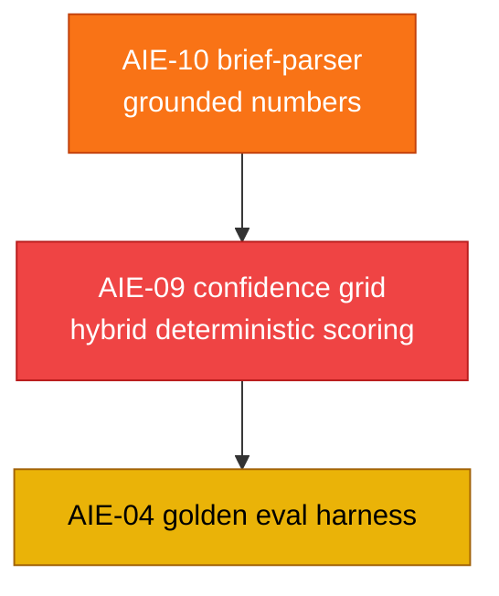

# AI Service — Story Backlog (Canonical Index)

> **Scope:** every engineering story that touches `ai-service/app/*` — bugs, robustness, and net-new AI features. This is the **single source of truth** for AI-service story status. Statuses were **verified against the actual code**, not the older spec docs (which had drifted out of sync).
>
> **Last verified:** 2026-07-19 against `ai-service/app/`.
> **Policy:** once a story is implemented and verified, its story file is **removed** (recoverable from git history). Only stories with **remaining work** keep a live file.

---

## 1. Headline finding — confidence scores are LLM-fabricated, not computed

The review confirmed the core concern: several "confidence"/score fields are produced by **asking the LLM for a number** rather than computing them from real signals. Two stories capture the fix:

| ID | Story | What's wrong | Priority | Status |
|:---|:---|:---|:---:|:---:|
| `AIE-09` | [Confidence grid hybrid scoring](./AIE-09-confidence-grid-hybrid-scoring.md) | All 4 grid sub-scores (budget, deliverable coverage, feasibility, timeline) are raw LLM outputs, then averaged. Should be deterministic factors + bounded LLM judgment. | 🔴 Critical | 🔴 Todo |
| `AIE-10` | [Brief parser ungrounded numbers](./AIE-10-brief-parser-ungrounded-confidence.md) | `confidence_pct`, `risk.severity`, `impact_score`, `market.relevance` are LLM-invented. Should be derived deterministically from grounded fields. | 🟡 High | 🔴 Todo |

**Good patterns already in the codebase to mirror:** [`opportunity.py`](../../../ai-service/app/features/opportunity.py) (deterministic weighted scorer), [`skill_gap.py`](../../../ai-service/app/features/skill_gap.py) (deterministic coverage %), [`growth.py`](../../../ai-service/app/features/growth.py) (LLM phrasing only; numbers protected server-side).

---

## 2. Remaining AI-service stories (open work)

Legend: 🔴 Todo

| ID | Story | Priority | Status |
|:---|:---|:---:|:---:|
| `AIE-09` | [Confidence grid hybrid scoring](./AIE-09-confidence-grid-hybrid-scoring.md) | 🔴 Critical | 🔴 Todo |
| `AIE-10` | [Brief parser ungrounded numbers](./AIE-10-brief-parser-ungrounded-confidence.md) | 🟡 High | 🔴 Todo |
| `AIE-04` | [Golden AI eval harness](../../specifications/ai_features/stories/AIE-04-ai-eval-harness.md) | 🟡 High | 🔴 Todo |

### Recommended order

| # | Story | Why now |
|:--:|:---|:---|
| 1 | **AIE-10** | Grounds per-feature confidence at the source; the grid can then reuse it. Lower blast radius. |
| 2 | **AIE-09** | The flagship fix — makes the headline trust signal real, reproducible, and explainable. |
| 3 | **AIE-04** | Once scores are deterministic, a golden-set harness can regression-gate them meaningfully. |

---

## 3. Implemented & removed (verified 2026-07-19)

These stories are **done in code**; their story files were removed and are recoverable from git history.

| ID | What it delivered | Evidence in code |
|:---|:---|:---|
| `AIE-01` | Model allow-list + boot fail-fast | `ALLOWED_MODELS`/`model_valid` in `config.py`; startup check + `/health` in `main.py`; `resolve_model()` |
| `AIE-02` | Honest brief-parser salvage fallback | `ParseBriefResponse{source, degradedReason}` + `partial_salvage` in `brief_parser.py` |
| `AIE-03` | Confidence-grid regression guard | Per-step baseline `new_confidence >= confidence_index + min_improvement` |
| `AIE-06` | Opportunity intelligence scoring | `schemas/opportunity.py` + deterministic `features/opportunity.py` + `/ai/opportunity/score` |
| `AIE-07` | Fallback logger hardening | `FallbackFieldsFilter` in `fallback_logger.py` |
| `AIE-08` | Request-model validation hole closed | `Union[str, dict]` / `Union[str, list]` in `main.py` (no bare `Any`) |
| `AIA-02` | Gemini result cache | `llm/cache.py` wired into `generate_structured()` (fallbacks never cached) |
| `AIA-03` | Deterministic skill-gap bridge | `features/skill_gap.py`; server-side missing-skill derivation in `/ai/interview/generate` |
| `AIA-06` | AI observability & telemetry | `telemetry.py` + request-id middleware + `/health` metrics |
| `AIA-07` | Gemini circuit breaker | `llm/circuit_breaker.py` (`primary_breaker`) in `gemini.py` |
| `AI-007` | Freelancer growth plan engine | `schemas/growth.py` + `features/growth.py` + `/ai/growth/plan` |
| `BUG-02` | Gemini unbounded-hang timeout | `asyncio.wait_for` + bounded retry/backoff in `gemini.py` |
| `BUG-03` | WebSocket sync auth | JWT-gated upgrade + ownership checks in `syncServer.ts` |
| `BUG-05` | Confidence-grid double-eval | Each proposal evaluated once per cycle |

> **Out of scope for this directory (TypeScript backend, still open):** `BUG-01`, `BUG-04`, `BUG-06`, `BUG-07` — tracked in the [backend story backlog](../../specifications/ai_features/stories/README.md).

---

## 4. Cross-references

| Document | Relevance |
|:---|:---|
| [AI features index](../../specifications/ai_features/README.md) | Feature registry (AI-001 … AI-007) |
| [Implementation status board](../../specifications/ai_features/IMPLEMENTATION_STATUS.md) | Older status doc (superseded; points here) |
| [Backend/security backlog](../../specifications/ai_features/stories/README.md) | Remaining `BUG-*` stories |
