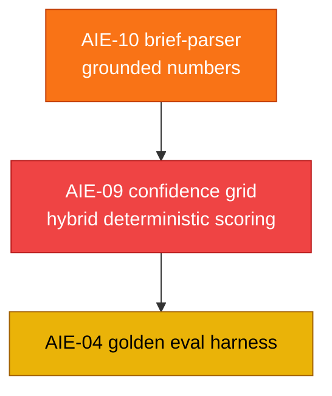

# AI Service — Story Backlog (Canonical Index)

> **Scope:** every engineering story that touches `ai-service/app/*` — bugs, robustness, and net-new AI features. This is the **single source of truth** for AI-service story status. Statuses below are **verified against the actual code**, not the older spec docs (which had drifted out of sync).
>
> **Last verified:** 2026-07-19 against `ai-service/app/`.

---

## How this directory is organized

- **New improvement stories** (found in the 2026-07-19 review) live *here* in `docs/stories/ai-service/`.
- **Pre-existing stories** still live in [`docs/specifications/ai_features/stories/`](../../specifications/ai_features/stories/README.md) and are linked below with their corrected status. They were left in place to preserve their internal cross-links; this index is the authoritative status board.

---

## 1. Headline finding — confidence scores are LLM-fabricated, not computed

The review confirmed the core concern: several "confidence"/score fields are produced by **asking the LLM for a number** rather than computing them from real signals. Two stories capture the fix:

| ID | Story | What's wrong | Priority | Status |
|:---|:---|:---|:---:|:---:|
| `AIE-09` | [Confidence grid hybrid scoring](./AIE-09-confidence-grid-hybrid-scoring.md) | All 4 grid sub-scores (budget, deliverable coverage, feasibility, timeline) are raw LLM outputs, then averaged. Should be deterministic factors + bounded LLM judgment. | 🔴 Critical | 🔴 Todo |
| `AIE-10` | [Brief parser ungrounded numbers](./AIE-10-brief-parser-ungrounded-confidence.md) | `confidence_pct`, `risk.severity`, `impact_score`, `market.relevance` are LLM-invented. Should be derived deterministically from grounded fields. | 🟡 High | 🔴 Todo |

**Good patterns already in the codebase to mirror:** [`opportunity.py`](../../../ai-service/app/features/opportunity.py) (deterministic weighted scorer), [`skill_gap.py`](../../../ai-service/app/features/skill_gap.py) (deterministic coverage %), [`growth.py`](../../../ai-service/app/features/growth.py) (LLM phrasing only; numbers protected server-side).

---

## 2. Full story status board (code-verified)

Legend: ✅ Done · 🟡 Partial · 🔴 Todo

### Net-new improvement stories (this directory)

| ID | Story | Priority | Status |
|:---|:---|:---:|:---:|
| `AIE-09` | [Confidence grid hybrid scoring](./AIE-09-confidence-grid-hybrid-scoring.md) | 🔴 Critical | 🔴 Todo |
| `AIE-10` | [Brief parser ungrounded numbers](./AIE-10-brief-parser-ungrounded-confidence.md) | 🟡 High | 🔴 Todo |

### Pre-existing AI-service stories (in `../../specifications/ai_features/stories/`)

| ID | Story | Priority | Status | Evidence in code |
|:---|:---|:---:|:---:|:---|
| `AIE-01` | [Model allow-list & fail-fast](../../specifications/ai_features/stories/AIE-01-model-allowlist-failfast.md) | 🔴 Critical | ✅ Done | `ALLOWED_MODELS` + `model_valid` in `config.py`; boot fail-fast + `/health` in `main.py` |
| `AIE-02` | [Brief-parser honest salvage fallback](../../specifications/ai_features/stories/AIE-02-brief-parser-salvage-fallback.md) | 🔴 Critical | ✅ Done | `ParseBriefResponse{source, degradedReason}` + `partial_salvage` path in `brief_parser.py` |
| `AIE-03` | [Confidence-grid regression guard](../../specifications/ai_features/stories/AIE-03-confidence-grid-regression-guard.md) | 🟡 High | ✅ Done | `improved = new_confidence >= confidence_index + min_improvement` (per-step baseline) |
| `AIE-04` | [Golden AI eval harness](../../specifications/ai_features/stories/AIE-04-ai-eval-harness.md) | 🟡 High | 🔴 Todo | No `ai-service/eval/` directory exists |
| `AIE-06` | [Opportunity intelligence scoring](../../specifications/ai_features/stories/AIE-06-opportunity-intelligence-scoring.md) | 🟡 High | ✅ Done | `schemas/opportunity.py` + `features/opportunity.py` (deterministic) + `/ai/opportunity/score` |
| `AIE-07` | [Fallback logger hardening](../../specifications/ai_features/stories/AIE-07-fallback-logger-hardening.md) | 🟡 Medium | ✅ Done | `FallbackFieldsFilter` guarantees fields in `fallback_logger.py` |
| `AIE-08` | [`Union[..., Any]` validation hole](../../specifications/ai_features/stories/AIE-08-request-model-any-union-validation-hole.md) | 🟡 Medium | ✅ Done | Request models now use `Union[str, dict]` / `Union[str, list]` (no bare `Any`) in `main.py` |
| `AIA-02` | [Gemini result cache](../../specifications/ai_features/stories/AIA-02-gemini-result-cache.md) | 🟡 High | ✅ Done | `llm/cache.py` wired into `generate_structured()` (never caches fallback) |
| `AIA-03` | [Deterministic skill-gap bridge](../../specifications/ai_features/stories/AIA-03-deterministic-skill-gap-bridge.md) | 🟡 High | ✅ Done | `features/skill_gap.py`; server-side missing-skill derivation in `/ai/interview/generate` |
| `AIA-06` | [AI observability & telemetry](../../specifications/ai_features/stories/AIA-06-ai-observability-telemetry.md) | 🟡 High | ✅ Done | `telemetry.py` + `record_call`/request-id middleware + `/health` metrics |
| `AIA-07` | [Gemini circuit breaker](../../specifications/ai_features/stories/AIA-07-gemini-circuit-breaker.md) | 🟡 Medium | ✅ Done | `llm/circuit_breaker.py` (`primary_breaker`) integrated in `gemini.py` |
| `AI-007` | [Freelancer growth plan engine](../../specifications/ai_features/stories/AI-007-freelancer-growth-plan-engine.md) | 🟡 High | ✅ Done | `schemas/growth.py` + `features/growth.py` (deterministic + LLM phrasing) + `/ai/growth/plan` |
| `BUG-02` | [Gemini unbounded request hang](../../specifications/ai_features/stories/BUG-02-gemini-unbounded-hang.md) | 🔴 Critical | ✅ Done | `asyncio.wait_for` timeout + bounded retry/backoff in `gemini.py` |
| `BUG-05` | [Confidence grid double-evaluation](../../specifications/ai_features/stories/BUG-05-confidence-grid-double-eval.md) | 🟡 Medium | ✅ Done | Loop evaluates optimized proposal exactly once per cycle |

> **Out of scope for this directory (TypeScript backend):** `AIE-05` (reputation→matching), `AIA-01` (async eval jobs), `AIA-04` (discovery automation), and `BUG-01/03/04/06/07`. These are tracked in the [backend story backlog](../../specifications/ai_features/stories/README.md).

---

## 3. Remaining AI-service work — recommended order

| # | Story | Why now |
|:--:|:---|:---|
| 1 | **AIE-10** | Grounds per-feature confidence at the source; the grid can then reuse it. Lower blast radius. |
| 2 | **AIE-09** | The flagship fix — makes the headline trust signal real, reproducible, and explainable. |
| 3 | **AIE-04** | Once scores are deterministic, a golden-set harness can regression-gate them meaningfully. |

Everything else in the board above is already ✅ done in code.

---

## 4. Cross-references

| Document | Relevance |
|:---|:---|
| [AI features index](../../specifications/ai_features/README.md) | Feature registry (AI-001 … AI-007) |
| [Implementation status board](../../specifications/ai_features/IMPLEMENTATION_STATUS.md) | Older status doc (now corrected to point here) |
| [Original story backlog](../../specifications/ai_features/stories/README.md) | Home of the pre-existing story files |
