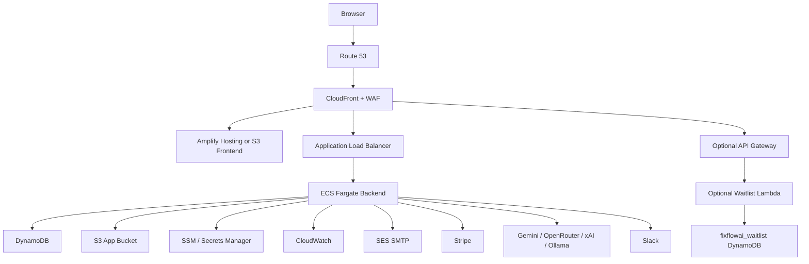

# FixFlowAI AWS Architecture

## Required Runtime Services

- Frontend hosting: Amplify Hosting or S3 + CloudFront.
- Backend hosting: ECS Fargate.
- Backend ingress: ALB.
- Database: DynamoDB.
- Object storage: S3.
- Secrets/config: SSM Parameter Store or Secrets Manager.
- Logs/metrics: CloudWatch.
- DNS/TLS: Route 53 and ACM.

## Optional Runtime Services

- WAF for production edge protection.
- API Gateway + Lambda for standalone waitlist.
- SES for AWS-native SMTP.
- ElastiCache Redis later for shared rate limits or pub/sub.
- SQS/SNS later for background jobs and notifications.

## Not Required For Current Code

- RDS.
- MongoDB.
- Kubernetes/EKS.
- nginx.
- Redis at launch.
- WebSocket API.
