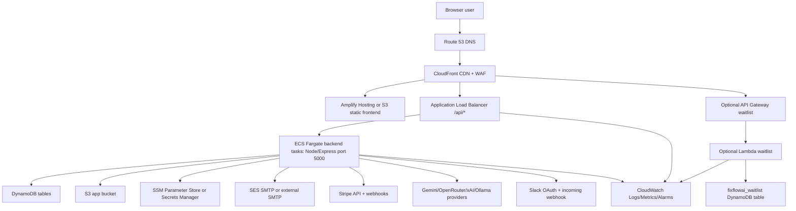
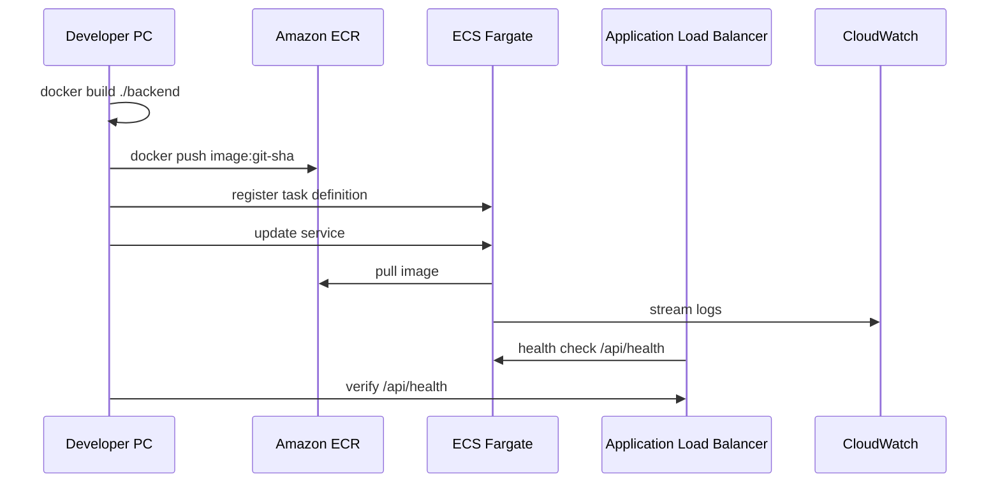

# FixFlowAI AWS Deployment Roadmap

Last updated: 2026-05-24

This roadmap is specific to this repository. It is based on the current codebase scan, including `package.json`, `backend/package.json`, `backend/Dockerfile`, `.env.example`, `backend/.env.example`, `backend/src/app.js`, `backend/src/config/env.js`, `backend/src/db`, `backend/src/models`, `.github/workflows/cicd.yml`, `scripts/deploy-aws.ps1`, `lambda/waitlist`, and `reference/aws-resources.md`.

Important finding: the README still mentions MongoDB in a few diagrams, but the active backend code uses DynamoDB through `backend/src/db/dynamoModel.js`. Deploy DynamoDB, not MongoDB or RDS, unless you intentionally rewrite the data layer.

## 1. Project Architecture Overview

FixFlowAI is a full-stack AI proposal platform with:

- Frontend: React 18 SPA built with Vite 5, Tailwind CSS, React Router, React Query, Zustand, Three.js, Framer Motion.
- Backend: Node.js 20 Express 5 API in `backend/`.
- Database: Amazon DynamoDB tables generated from backend model names.
- File/object storage: Amazon S3 for brief uploads, avatars, proposal JSON versions, and generated/exported objects.
- AI services: Google Gemini primary, with OpenRouter, xAI, and Ollama-compatible fallback providers.
- Auth: email/password, JWT access tokens, refresh cookie, CSRF token, GitHub OAuth, Google OAuth.
- Billing: Stripe Checkout, Stripe webhooks, subscription state in DynamoDB.
- Email: SMTP through Nodemailer for OTP/reset/lifecycle emails. Amazon SES is the AWS-native SMTP option.
- Realtime: Server-Sent Events, not WebSockets. Used for proposal generation, proposal chat, niche analysis, and notification streaming.
- Integrations: Slack OAuth and incoming webhook storage encrypted with `INTEGRATION_SECRET`.
- Waitlist: optional AWS Lambda + API Gateway path under `lambda/waitlist`.
- Smart contract: `contracts/src/FixFlowEscrow.sol` is present but not wired into the production app runtime. Escrow app workflows currently use backend APIs and DynamoDB models.

Detected ports:

- Frontend dev server: `3001` from `vite.config.js`.
- Backend API: `5000` from `backend/.env.example`, `backend/Dockerfile`, and ECS task definition.

Detected deployment assets:

- `backend/Dockerfile`: production backend container, Node 20 Alpine, Chromium installed for Puppeteer PDF export, exposes port `5000`.
- `backend/task-definition.json`: ECS Fargate task definition, currently hardcoded to old account/resource names in places. Treat it as a starting template and replace account IDs, roles, repository names, and SSM paths.
- `.github/workflows/cicd.yml`: CI builds frontend, tests backend, builds Docker image, deploys backend to ECS/ECR, deploys frontend to Amplify.
- `scripts/deploy-aws.ps1`: manual deployment script, also contains old `proplytics` naming and hardcoded AWS account/distribution values. Use only after replacing those values.

Recommended production architecture:



Request flow:

1. User opens `https://fixflowai.com`.
2. Route 53 sends DNS to CloudFront.
3. CloudFront serves frontend assets from Amplify Hosting or S3.
4. Frontend calls `VITE_API_URL`, normally `https://api.fixflowai.com/api` or `https://fixflowai.com/api`.
5. CloudFront or DNS routes API traffic to an Application Load Balancer.
6. ALB forwards to ECS Fargate backend tasks on port `5000`.
7. Backend reads/writes DynamoDB, stores files in S3, calls LLM providers, sends email, handles Stripe and Slack callbacks.
8. Backend emits SSE streams over normal HTTPS responses. No WebSocket infrastructure is required.

Folder structure summary:

```text
.
├── src/                         # Active React/Vite frontend
├── backend/                     # Active Express API
│   ├── Dockerfile               # Backend container build
│   ├── task-definition.json     # ECS Fargate task definition template
│   └── src/
│       ├── app.js               # Express middleware and route registration
│       ├── config/env.js        # Required runtime env schema
│       ├── db/                  # DynamoDB client + Mongoose-like adapter
│       ├── models/              # DynamoDB-backed app tables
│       ├── routes/              # API endpoints
│       └── services/            # LLM, S3, Stripe, Slack, email, notifications
├── lambda/waitlist/             # Optional Lambda waitlist function
├── contracts/                   # Solidity escrow contract, not active runtime infra
├── .github/workflows/cicd.yml   # Existing GitHub Actions pipeline
├── scripts/deploy-aws.ps1       # Existing manual deploy helper
└── reference/                   # Deployment docs
```

## 2. AWS Services Required

Use this service set for a production deployment.

| Service | Required | Purpose in this project | Why needed | Estimate | Alternative | Security recommendations |
|---|---:|---|---|---|---|---|
| IAM | Required | Users, roles, ECS task permissions, GitHub OIDC | Controls who can deploy and what services can access | Usually no direct charge | None | MFA, least privilege, no root access keys |
| VPC | Required | Network boundary for ALB and ECS | Backend needs controlled networking | VPC itself usually no charge; NAT/public IPv4 can cost | Default VPC for dev only | Separate public/private subnets |
| ECS Fargate | Required | Runs Express backend container | Long-running API and SSE streams fit containers better than Lambda | Pay per vCPU/memory second; current task is 0.25 vCPU/1GB | EC2, Elastic Beanstalk, App Runner | Run tasks in private subnets, no SSH |
| ECR | Required | Stores backend Docker image | ECS pulls backend image from ECR | Low storage cost for images | Docker Hub, GitHub Container Registry | Enable image scan on push |
| Application Load Balancer | Required for production | Stable HTTPS origin for backend ECS service | Avoid CloudFront pointing to changing ECS task public DNS | Charged hourly plus LCU | CloudFront direct to task for temporary dev only | Security group only accepts 443/80 from internet |
| CloudFront | Required | CDN, HTTPS edge, optional `/api/*` routing, WAF attachment | Faster frontend and secure edge | Pay per request/data transfer | Amplify-managed CDN only | Redirect HTTP to HTTPS, attach WAF |
| Amplify Hosting | Recommended | Current CI deploys frontend here | Simplest Vite SPA hosting with branches and SSL | Pay build minutes, storage, data served | S3 + CloudFront | Set only public `VITE_` vars |
| S3 | Required | App storage bucket and optional frontend hosting | Brief uploads, avatars, proposal version JSON | Storage + requests; usually low at startup | EFS not needed | Block public access for app bucket |
| DynamoDB | Required | Primary database | Code uses DynamoDB SDK and model adapter | On-demand pay per request/storage | MongoDB Atlas only after code rewrite | Point-in-time recovery, encryption, IAM-limited access |
| SSM Parameter Store | Required | Existing task definition reads secrets from SSM | Stores env config/secrets without `.env` in containers | Standard parameters often cheap/free; advanced costs more | Secrets Manager | Use SecureString for secrets |
| Secrets Manager | Optional but recommended | Stripe/Gemini/OAuth/Slack secrets with rotation | Better secret lifecycle than SSM | Per secret/month + API calls | SSM SecureString | Rotate high-risk secrets |
| CloudWatch | Required | ECS, ALB, Lambda logs and alarms | Needed for debugging and production monitoring | Logs/alarms/metrics usage-based | Datadog/Sentry add-on | Retention policies, metric alarms |
| Route 53 | Required if using AWS DNS | Domain DNS and hosted zone | Connects domain to CloudFront/API | Hosted zone + DNS queries | Cloudflare DNS | DNSSEC optional, least privilege |
| ACM | Required | TLS certs for CloudFront and ALB | HTTPS for frontend/API/cookies/OAuth | Public certs used with AWS integrated services are generally no extra charge | External certs | Use us-east-1 cert for CloudFront |
| AWS WAF | Recommended | Rate/filter edge requests | Protect public frontend/API from common abuse | Web ACL + rules + requests | Cloudflare WAF | Managed rules, rate-based rules |
| SES | Recommended | SMTP for reset/lifecycle emails | Replaces external SMTP with AWS email | Low per-email cost after sandbox exit | SendGrid/Mailgun/Gmail SMTP | Verify domain, SPF/DKIM/DMARC |
| API Gateway + Lambda | Optional | Existing waitlist function | Good for small standalone waitlist endpoint | Request/invocation based | Put waitlist into Express API | Validate origins, limit IAM to waitlist table |
| CloudTrail | Required | Audit AWS account/API actions | Security incident trail | Management events commonly enabled by default; storage may cost | None | Send to locked S3 bucket |
| SQS/SNS | Optional future | Background jobs and async alerts | Not currently used in code | Usage based | EventBridge | Add when email/export/LLM jobs need queues |
| ElastiCache Redis | Optional future | Shared rate limiting/session pubsub | Not currently used; current rate limit is in-process | Node hourly | DynamoDB TTL/cache | Needed if you run many API tasks and want global rate limits |
| RDS | Not required | Relational DB | Not used by current code | N/A | DynamoDB already active | Do not deploy unless rewriting data layer |
| Cognito | Not required | Managed auth | Current app implements auth itself | N/A | Current JWT/OAuth flow | Consider later to reduce auth ownership |

Pricing note: exact AWS pricing changes by region and usage. Before creating resources, verify current numbers in the AWS Pricing Calculator and official pricing pages for Fargate, DynamoDB, S3, CloudFront, ALB, WAF, CloudWatch, Route 53, VPC/NAT, Amplify, Secrets Manager, and SES.

## 3. Deployment Strategy

Recommended strategy: two-service deployment.

- Frontend service: static Vite SPA deployed to Amplify Hosting or S3 + CloudFront.
- Backend service: one containerized Express API deployed to ECS Fargate.
- Data services: DynamoDB and S3 managed services.
- Optional edge/serverless service: Lambda waitlist endpoint.

This is not a microservices app yet. The backend is one API service with many route modules. Keep it as one container until traffic or team ownership forces a split.

Container strategy:

- Build only `backend/` into a Docker image.
- Push image to ECR.
- ECS task runs `node src/index.js`.
- Container exposes port `5000`.
- Health check calls `GET /api/health`.
- Use 0.25 vCPU / 1 GB memory for starter production, because the current task definition already uses this and Puppeteer/Chromium needs memory.
- Move to 0.5 vCPU / 2 GB if PDF export, AI streaming, or concurrent uploads cause memory pressure.

Reverse proxy and routing:

- Production best practice: CloudFront -> ALB -> ECS.
- API path option: CloudFront behavior `/api/*` goes to ALB origin.
- Simpler DNS option: `app.fixflowai.com` or apex domain goes to Amplify/CloudFront, `api.fixflowai.com` goes to ALB.
- Avoid using CloudFront origin set directly to an ECS task public DNS in production. The existing `scripts/deploy-aws.ps1` does this, but ECS task public DNS can change on every deployment.

SSL setup:

- Request ACM certificate in `us-east-1` for CloudFront.
- Request ACM certificate in the backend region, also `us-east-1` if you deploy there, for ALB.
- Force HTTPS at CloudFront and ALB.
- Set backend `NODE_ENV=production` so cookies and HSTS behavior are production-safe.

SSE support:

- This app uses Server-Sent Events on long requests. Configure CloudFront/ALB idle timeout high enough for `STREAM_TIMEOUT_MS=120000`.
- ALB idle timeout: set to at least 180 seconds.
- CloudFront origin response timeout: set high enough for streaming endpoints.
- Do not buffer SSE responses through nginx unless explicitly configured for no buffering. No nginx config exists in this repo.

## 4. Local Preparation

Install tools:

```powershell
# Windows package manager examples
winget install Amazon.AWSCLI
winget install Docker.DockerDesktop
winget install Git.Git
winget install OpenJS.NodeJS.LTS
```

Verify:

```powershell
aws --version
docker --version
node --version
npm --version
git --version
```

Configure AWS CLI:

```powershell
aws configure
# AWS Access Key ID: use your deploy IAM user key, not root
# AWS Secret Access Key: deploy IAM user secret
# Default region name: us-east-1
# Default output format: json
aws sts get-caller-identity
```

Generate an SSH key only if you choose EC2. ECS Fargate does not need SSH:

```powershell
ssh-keygen -t ed25519 -C "fixflowai-deploy"
```

Repository preparation:

```powershell
npm install
npm --prefix backend install
npm run build
npm --prefix backend test
docker build -t fixflowai-backend:local ./backend
```

Do not commit `.env` or `backend/.env`. Keep only `.env.example` files.

## 5. AWS Account Setup

Beginner-safe AWS account checklist:

1. Sign in as root only for account setup.
2. Enable MFA on root.
3. Create an IAM admin user for daily console use.
4. Create an IAM deployment role or user for CLI/GitHub deployment.
5. Create a billing budget.
6. Enable CloudTrail.
7. Choose one primary region. This repo mostly uses `us-east-1`; keep everything there unless you have a reason to use another region.

Budget setup through console:

1. Open AWS Console.
2. Go to Billing and Cost Management.
3. Choose Budgets.
4. Create monthly cost budget.
5. Start with alerts at `$20`, `$50`, and `$100`.
6. Add your email.

VPC setup:

- VPC CIDR: `10.0.0.0/16`.
- Public subnets: `10.0.1.0/24`, `10.0.2.0/24` in two Availability Zones.
- Private subnets: `10.0.11.0/24`, `10.0.12.0/24` in two Availability Zones.
- Internet Gateway: attach to VPC.
- NAT Gateway: optional for cheapest deployment, recommended for private ECS tasks that need internet access to call Gemini/Stripe/Slack/GitHub/Google.
- Route tables:
  - Public route table: `0.0.0.0/0` -> Internet Gateway.
  - Private route table: `0.0.0.0/0` -> NAT Gateway.

Cost choice:

- Cheapest: put ECS tasks in public subnets with public IP and use ALB in public subnets. This avoids NAT Gateway cost but exposes tasks more than necessary. Security groups still protect tasks.
- Production recommended: ALB in public subnets, ECS tasks in private subnets, NAT Gateway for outbound internet.
- Cost-optimized production: one NAT Gateway in one AZ at first, then two NAT Gateways for high availability when revenue justifies it.

Security groups:

| Security group | Inbound | Outbound |
|---|---|---|
| `fixflowai-alb-sg` | 80/443 from `0.0.0.0/0` | 5000 to ECS task SG |
| `fixflowai-ecs-sg` | 5000 from ALB SG only | HTTPS 443 to internet, DynamoDB/S3 endpoints if configured |
| `fixflowai-vpc-endpoints-sg` | 443 from ECS SG | 443 as needed |

## 6. Infrastructure Setup

Use names consistently:

```text
Project: fixflowai
Environment: prod
Region: us-east-1
ECR repo: fixflowai-backend
ECS cluster: fixflowai-cluster
ECS service: fixflowai-backend-service
Task family: fixflowai-backend
S3 app bucket: fixflowai-prod-assets-<account-id>
DynamoDB prefix: fixflowai
CloudWatch log group: /ecs/fixflowai-backend
SSM path: /fixflowai/prod/
```

### ECR

Console:

1. Open ECR.
2. Create repository.
3. Name: `fixflowai-backend`.
4. Visibility: Private.
5. Image tag mutability: Mutable for beginner deploys, Immutable for stricter production.
6. Scan on push: Enabled.

CLI:

```powershell
aws ecr create-repository `
  --repository-name fixflowai-backend `
  --image-scanning-configuration scanOnPush=true `
  --region us-east-1
```

### S3 App Bucket

Create a private bucket for backend uploads:

```powershell
$ACCOUNT_ID = aws sts get-caller-identity --query Account --output text
$BUCKET = "fixflowai-prod-assets-$ACCOUNT_ID"

aws s3api create-bucket --bucket $BUCKET --region us-east-1
aws s3api put-public-access-block --bucket $BUCKET --public-access-block-configuration `
  BlockPublicAcls=true,IgnorePublicAcls=true,BlockPublicPolicy=true,RestrictPublicBuckets=true
aws s3api put-bucket-versioning --bucket $BUCKET --versioning-configuration Status=Enabled
aws s3api put-bucket-encryption --bucket $BUCKET --server-side-encryption-configuration `
  '{"Rules":[{"ApplyServerSideEncryptionByDefault":{"SSEAlgorithm":"AES256"}}]}'
```

S3 CORS for presigned uploads from the frontend:

```json
[
  {
    "AllowedHeaders": ["*"],
    "AllowedMethods": ["PUT", "GET"],
    "AllowedOrigins": ["https://fixflowai.com", "https://www.fixflowai.com"],
    "ExposeHeaders": ["ETag"],
    "MaxAgeSeconds": 3000
  }
]
```

Apply CORS:

```powershell
aws s3api put-bucket-cors --bucket $BUCKET --cors-configuration file://s3-cors.json
```

### DynamoDB

The code resolves table names as:

```text
DYNAMODB_TABLE_PREFIX + "_" + modelName
```

With `DYNAMODB_TABLE_PREFIX=fixflowai`, create these tables:

```text
fixflowai_AgencyPattern
fixflowai_AuditLog
fixflowai_Credential
fixflowai_DealRoomAnnotation
fixflowai_Escrow
fixflowai_FreelancerProfile
fixflowai_Invoice
fixflowai_Lead
fixflowai_Niche
fixflowai_Notification
fixflowai_Portal
fixflowai_Proposal
fixflowai_ProposalEval
fixflowai_ProposalPresence
fixflowai_Session
fixflowai_Subscription
fixflowai_Trip
fixflowai_User
fixflowai_Workspace
fixflowai_waitlist
```

All current models use `_id` as the primary key. No GSIs are defined in code. The adapter performs table scans for many filters, so start with on-demand billing and add GSIs later when query patterns are optimized.

PowerShell table creation:

```powershell
$tables = @(
  "AgencyPattern","AuditLog","Credential","DealRoomAnnotation","Escrow",
  "FreelancerProfile","Invoice","Lead","Niche","Notification","Portal",
  "Proposal","ProposalEval","ProposalPresence","Session","Subscription",
  "Trip","User","Workspace"
)

foreach ($model in $tables) {
  aws dynamodb create-table `
    --table-name "fixflowai_$model" `
    --attribute-definitions AttributeName=_id,AttributeType=S `
    --key-schema AttributeName=_id,KeyType=HASH `
    --billing-mode PAY_PER_REQUEST `
    --region us-east-1
}

aws dynamodb create-table `
  --table-name fixflowai_waitlist `
  --attribute-definitions AttributeName=_id,AttributeType=S `
  --key-schema AttributeName=_id,KeyType=HASH `
  --billing-mode PAY_PER_REQUEST `
  --region us-east-1
```

Enable point-in-time recovery:

```powershell
foreach ($model in $tables) {
  aws dynamodb update-continuous-backups `
    --table-name "fixflowai_$model" `
    --point-in-time-recovery-specification PointInTimeRecoveryEnabled=true `
    --region us-east-1
}

aws dynamodb update-continuous-backups `
  --table-name fixflowai_waitlist `
  --point-in-time-recovery-specification PointInTimeRecoveryEnabled=true `
  --region us-east-1
```

### CloudWatch Log Group

```powershell
aws logs create-log-group --log-group-name /ecs/fixflowai-backend --region us-east-1
aws logs put-retention-policy --log-group-name /ecs/fixflowai-backend --retention-in-days 30 --region us-east-1
```

### SSM Parameters and Secrets

Use SecureString for secrets:

```powershell
aws ssm put-parameter --name /fixflowai/prod/JWT_SECRET --type SecureString --value "generate-a-strong-random-value" --overwrite
aws ssm put-parameter --name /fixflowai/prod/JWT_REFRESH_SECRET --type SecureString --value "generate-a-different-strong-value" --overwrite
aws ssm put-parameter --name /fixflowai/prod/GEMINI_API_KEY --type SecureString --value "your-key" --overwrite
aws ssm put-parameter --name /fixflowai/prod/STRIPE_SECRET_KEY --type SecureString --value "sk_live_..." --overwrite
aws ssm put-parameter --name /fixflowai/prod/STRIPE_WEBHOOK_SECRET --type SecureString --value "whsec_..." --overwrite
aws ssm put-parameter --name /fixflowai/prod/INTEGRATION_SECRET --type SecureString --value "32-plus-char-random-value" --overwrite
```

Use String for non-secrets:

```powershell
aws ssm put-parameter --name /fixflowai/prod/FRONTEND_URL --type String --value "https://fixflowai.com" --overwrite
aws ssm put-parameter --name /fixflowai/prod/FRONTEND_ALLOWED_ORIGINS --type String --value "https://fixflowai.com,https://www.fixflowai.com" --overwrite
aws ssm put-parameter --name /fixflowai/prod/GITHUB_CALLBACK_URL --type String --value "https://api.fixflowai.com/api/auth/github/callback" --overwrite
aws ssm put-parameter --name /fixflowai/prod/GOOGLE_CALLBACK_URL --type String --value "https://api.fixflowai.com/api/auth/google/callback" --overwrite
aws ssm put-parameter --name /fixflowai/prod/SLACK_REDIRECT_URI --type String --value "https://api.fixflowai.com/api/integrations/slack/callback" --overwrite
```

### ALB

Console:

1. Open EC2.
2. Choose Load Balancers.
3. Create Application Load Balancer.
4. Scheme: Internet-facing.
5. IP address type: IPv4.
6. VPC: `fixflowai-vpc`.
7. Subnets: two public subnets.
8. Security group: `fixflowai-alb-sg`.
9. Listener 80: redirect to 443 after SSL is ready.
10. Listener 443: forward to target group.
11. Target group type: IP.
12. Protocol: HTTP.
13. Port: 5000.
14. Health check path: `/api/health`.
15. Success code: `200`.

Set ALB idle timeout to 180 seconds for SSE:

```powershell
aws elbv2 modify-load-balancer-attributes `
  --load-balancer-arn <alb-arn> `
  --attributes Key=idle_timeout.timeout_seconds,Value=180 `
  --region us-east-1
```

## 7. Database Deployment

Detected database: DynamoDB.

Not detected:

- PostgreSQL
- MySQL
- MongoDB runtime dependency
- Redis
- Prisma
- Mongoose active dependency

Managed vs self-hosted:

- Use managed DynamoDB. Do not self-host a database.
- Use on-demand billing for the first production release.
- Enable point-in-time recovery on every table.
- Use deletion protection through IAM policy discipline and infrastructure tags.

Security hardening:

- ECS task role should allow only `GetItem`, `PutItem`, `UpdateItem`, `DeleteItem`, `Query`, `Scan`, `BatchWriteItem`, `BatchGetItem` on `arn:aws:dynamodb:us-east-1:<account-id>:table/fixflowai_*`.
- Lambda waitlist role should access only `fixflowai_waitlist`.
- Do not put AWS access keys in ECS env vars. Use task roles.

Migration steps:

1. Create all DynamoDB tables.
2. Enable PITR.
3. Deploy backend with `DYNAMODB_TABLE_PREFIX=fixflowai`.
4. Run `GET /api/health`.
5. Register a test user.
6. Confirm `fixflowai_User`, `fixflowai_Session`, and `fixflowai_AuditLog` receive records.

Scaling warning:

The current DynamoDB adapter uses scans for many filter operations. This is acceptable for a small launch but will become expensive/slow. Before enterprise scale, add real query access patterns and GSIs such as:

- `User.email`
- `Session.userId`
- `Proposal.createdBy`
- `Proposal.workspaceId`
- `Notification.userId`
- `Portal.token`
- `Workspace.members.userId` may need a membership table instead of nested scans

## 8. Backend Deployment

Required backend runtime:

- Node.js 20.
- Express 5.
- Port `5000`.
- Container has Chromium for Puppeteer PDF exports.
- Health endpoint: `GET /api/health`.

Build locally:

```powershell
docker build -t fixflowai-backend:latest ./backend
```

Push to ECR:

```powershell
$ACCOUNT_ID = aws sts get-caller-identity --query Account --output text
$REGION = "us-east-1"
$REPO = "$ACCOUNT_ID.dkr.ecr.$REGION.amazonaws.com/fixflowai-backend"

aws ecr get-login-password --region $REGION | docker login --username AWS --password-stdin "$ACCOUNT_ID.dkr.ecr.$REGION.amazonaws.com"
docker tag fixflowai-backend:latest "$REPO:latest"
docker push "$REPO:latest"
```

ECS task settings:

```text
Launch type: Fargate
CPU: 0.25 vCPU to start
Memory: 1 GB minimum
Container port: 5000
Platform: Linux
Architecture: x86_64 unless you rebuild/test on ARM
Log driver: awslogs
Health check: node HTTP check to /api/health
```

Backend environment variables:

```env
PORT=5000
NODE_ENV=production
REQUEST_BODY_LIMIT=1mb
FRONTEND_URL=https://fixflowai.com
FRONTEND_ALLOWED_ORIGINS=https://fixflowai.com,https://www.fixflowai.com
JWT_ACCESS_EXPIRY=15m
JWT_REFRESH_EXPIRY=7d
AWS_REGION=us-east-1
DYNAMODB_TABLE_PREFIX=fixflowai
DYNAMODB_ENDPOINT=
S3_BUCKET=fixflowai-prod-assets-<account-id>
STREAM_TIMEOUT_MS=120000
PUPPETEER_EXECUTABLE_PATH=/usr/bin/chromium-browser
USE_FAKE_LLM=false
OPPORTUNITY_DISCOVERY_DEMO_FALLBACK=false
ALLOW_DEMO_SEED=false
BID_MATCH_THRESHOLD=70
RATE_LIMIT_MONITOR_ENABLED=true
RATE_LIMIT_NEAR_THRESHOLD=0.85
```

Backend secrets:

```env
JWT_SECRET=<secure random 32+ chars>
JWT_REFRESH_SECRET=<different secure random 32+ chars>
GITHUB_CLIENT_ID=<id>
GITHUB_CLIENT_SECRET=<secret>
GOOGLE_CLIENT_ID=<id>
GOOGLE_CLIENT_SECRET=<secret>
SMTP_HOST=email-smtp.us-east-1.amazonaws.com
SMTP_PORT=587
SMTP_SECURE=false
SMTP_USER=<ses smtp username>
SMTP_PASS=<ses smtp password>
SMTP_FROM="FixFlowAI <no-reply@fixflowai.com>"
EMAIL_FROM_ADDRESS=no-reply@fixflowai.com
EMAIL_FROM_NAME=FixFlowAI
ADMIN_ALERT_EMAIL=alerts@fixflowai.com
STRIPE_SECRET_KEY=<sk_live>
STRIPE_WEBHOOK_SECRET=<whsec>
STRIPE_FREE_PRICE_ID=<price id if used>
STRIPE_PRO_PRICE_ID=<price id>
STRIPE_AGENCY_PRICE_ID=<price id>
STRIPE_SOLO_PRICE_ID=<price id>
GEMINI_API_KEY=<key>
OPENROUTER_API_KEY=<optional>
XAI_API_KEY=<optional>
TAVILY_API_KEY=<optional>
BRAVE_SEARCH_API_KEY=<optional>
SERPAPI_API_KEY=<optional>
APIFY_API_TOKEN=<optional>
SLACK_CLIENT_ID=<id>
SLACK_CLIENT_SECRET=<secret>
INTEGRATION_SECRET=<secure random 32+ chars>
```

Important: `VITE_API_URL` belongs to the frontend build, not the backend container.

PM2/systemd:

- Do not use PM2 or systemd inside ECS Fargate.
- ECS manages process restart and replacement.
- If deploying manually on EC2 instead of ECS, then use systemd, not PM2, for production.

## 9. Frontend Deployment

Detected frontend: Vite React SPA, not Next.js.

Build command:

```powershell
$env:VITE_API_URL = "https://api.fixflowai.com/api"
npm install
npm run build
```

Build output:

```text
dist/
```

Recommended frontend option: Amplify Hosting, because current `.github/workflows/cicd.yml` already deploys there.

Amplify manual console steps:

1. Open AWS Amplify.
2. Create new app.
3. Choose Deploy without Git provider for manual zip deploy, or connect GitHub for branch deploys.
4. Build command: `npm run build`.
5. Output directory: `dist`.
6. Add environment variable: `VITE_API_URL=https://api.fixflowai.com/api`.
7. Deploy.
8. Add custom domain.

Alternative frontend option: S3 + CloudFront.

S3 static site bucket:

```powershell
$FRONTEND_BUCKET = "fixflowai-prod-frontend-$ACCOUNT_ID"
aws s3api create-bucket --bucket $FRONTEND_BUCKET --region us-east-1
aws s3 sync dist "s3://$FRONTEND_BUCKET" --delete
```

Use CloudFront Origin Access Control so the bucket stays private. Set SPA fallback:

- Default root object: `index.html`.
- Custom error response:
  - 403 -> `/index.html`, HTTP 200
  - 404 -> `/index.html`, HTTP 200

Cache optimization:

- Cache `assets/*` for a long time because Vite filenames are hashed.
- Cache `index.html` briefly so releases appear quickly.
- Do CloudFront invalidation after deploy:

```powershell
aws cloudfront create-invalidation --distribution-id <distribution-id> --paths "/*"
```

Next.js note:

- `apps/web/README.md` says a future Next.js migration may happen, but current production UI is still `src/` Vite.
- Do not deploy this as Next.js SSR today.

## 10. Docker Deployment

Current Dockerfile:

- Base: `node:20-alpine`
- Installs Chromium packages for Puppeteer
- Sets `PUPPETEER_EXECUTABLE_PATH=/usr/bin/chromium-browser`
- Runs `npm install --omit=dev`
- Copies `backend/src`
- Runs as non-root user `node`
- Exposes `5000`
- Starts `node src/index.js`

Recommended Docker improvements after first stable deploy:

- Add `.dockerignore` under `backend/` to exclude local files.
- Use `npm ci --omit=dev` once dependency lock issues are fixed.
- Consider multi-stage build only if backend grows a compile step.
- Pin Node minor version for reproducibility.

No `docker-compose.yml` was detected. You do not need Docker Compose for AWS ECS deployment.

ECS deployment sequence:



Container networking:

- ECS task network mode: `awsvpc`.
- Target group target type: `ip`.
- ALB forwards HTTP to target group port `5000`.
- ECS task security group accepts `5000` only from ALB security group.

## 11. CI/CD Pipeline

Current GitHub Actions pipeline:

- Pull requests to `testing` and `main`: install, test, audit, build frontend, validate Docker build.
- Push/manual dispatch: deploy backend to ECR/ECS, then deploy frontend to Amplify.
- AWS auth supports either GitHub OIDC role (`AWS_ROLE_ARN`) or static AWS keys.
- Existing hardcoded values include Amplify app ID, CloudFront URL, ECS names, and old SSM path `/proplytics/dev/...`.

Recommended GitHub secrets:

```text
AWS_ROLE_ARN
ECR_REPOSITORY
```

Avoid long-lived keys if possible. Use GitHub OIDC.

GitHub variables:

```text
AWS_REGION=us-east-1
AMPLIFY_APP_ID=<your amplify app id>
ECS_CLUSTER=fixflowai-cluster
ECS_SERVICE=fixflowai-backend-service
CONTAINER_NAME=fixflowai-backend
BACKEND_API_URL=https://api.fixflowai.com/api
```

Required pipeline edits before use:

1. Replace hardcoded `d22glq95zibf1w` with your Amplify app ID.
2. Replace `https://d6opkcrsagj0v.cloudfront.net/api` with your production API URL.
3. Replace SSM path `/proplytics/dev/` with `/fixflowai/prod/`.
4. Replace ECS cluster/service names if different.
5. Replace all account-specific ARNs in `backend/task-definition.json`.

Rollback strategy:

Backend rollback:

```powershell
aws ecs list-task-definitions --family-prefix fixflowai-backend --sort DESC --region us-east-1
aws ecs update-service `
  --cluster fixflowai-cluster `
  --service fixflowai-backend-service `
  --task-definition <previous-task-definition-arn> `
  --region us-east-1
aws ecs wait services-stable --cluster fixflowai-cluster --services fixflowai-backend-service --region us-east-1
```

Frontend rollback:

- Amplify: open Hosting -> Deployments -> redeploy previous successful job.
- S3/CloudFront: keep previous `dist` artifact zip and sync it back, then invalidate CloudFront.

Blue-green deployment:

- Starter: ECS rolling update with minimum healthy percent 100 and maximum percent 200.
- Enterprise: use CodeDeploy blue/green for ECS with two target groups and automatic rollback on alarms.

## 12. Security Hardening

Application security already present in code:

- `helmet` security headers.
- CORS allowlist from `FRONTEND_URL` and `FRONTEND_ALLOWED_ORIGINS`.
- Origin guard middleware.
- CSRF protection using `X-CSRF-Token`.
- HTTP-only refresh cookie.
- JWT access token flow.
- Express rate limits for auth, API, password reset, public portals, upload, generation, admin export.
- Request IDs.
- Audit logging to DynamoDB.
- Suspicious activity middleware.
- Input sanitization and Zod validation.
- Safe fetch allowlist for outbound calls.
- File type and ownership checks for S3 uploads.

AWS security checklist:

- Root MFA enabled.
- No root access keys.
- ECS task role, not static AWS keys.
- S3 public access blocked.
- DynamoDB least-privilege IAM.
- SSM/Secrets Manager for secrets.
- CloudTrail enabled.
- WAF attached to CloudFront and optionally ALB.
- ALB and ECS security groups restricted.
- HTTPS-only cookies by using `NODE_ENV=production`.
- CloudWatch log retention configured.
- ECR image scanning enabled.

WAF recommended rules:

- AWS Managed Rules Common Rule Set.
- Known Bad Inputs.
- Amazon IP Reputation List.
- Anonymous IP List if abuse appears.
- Rate-based rule for `/api/auth/*`.
- Rate-based rule for `/api/generate` and `/api/proposal/*/chat`.
- Allow Stripe webhook route but validate `stripe-signature` in app, which the code already does.

DDoS:

- AWS Shield Standard is automatically included for CloudFront and ALB.
- Shield Advanced is optional and expensive; only add when business risk justifies it.

SQL injection:

- No SQL database is detected.
- Still keep validation/sanitization because injection-like payloads can attack logs, prompts, and NoSQL filters.

SSH hardening:

- ECS Fargate does not require SSH.
- If you deploy to EC2, disable password login, use SSM Session Manager, restrict port 22 to your IP, and install fail2ban.

Secret rotation:

- Rotate JWT secrets carefully because active sessions will break.
- Rotate `INTEGRATION_SECRET` carefully because stored Slack webhook encrypted values may become unreadable unless you implement re-encryption.
- Rotate Stripe/OAuth/LLM keys from provider dashboards and update SSM/Secrets Manager.

## 13. Monitoring & Logging

Required CloudWatch log groups:

- `/ecs/fixflowai-backend`
- `/aws/lambda/fixflowai-waitlist` if using Lambda
- ALB access logs to S3, optional but recommended
- CloudFront standard logs or real-time logs, optional at launch

Starter alarms:

| Alarm | Metric | Threshold |
|---|---|---|
| Backend unhealthy | ALB HealthyHostCount | `< 1` for 2 periods |
| Backend 5xx | ALB HTTPCode_Target_5XX_Count | `> 5` in 5 minutes |
| ALB 5xx | ALB HTTPCode_ELB_5XX_Count | `> 1` in 5 minutes |
| ECS CPU high | ECSServiceAverageCPUUtilization | `> 70%` for 10 minutes |
| ECS memory high | ECSServiceAverageMemoryUtilization | `> 75%` for 10 minutes |
| DynamoDB throttles | ReadThrottleEvents/WriteThrottleEvents | `> 0` |
| Lambda errors | Errors | `> 0` |
| CloudFront 5xx | 5xxErrorRate | `> 2%` |

Create SNS topic for alerts:

```powershell
aws sns create-topic --name fixflowai-prod-alerts --region us-east-1
aws sns subscribe --topic-arn <topic-arn> --protocol email --notification-endpoint alerts@fixflowai.com --region us-east-1
```

Application-level monitoring:

- Add Sentry or OpenTelemetry later for frontend/backend stack traces.
- Use CloudWatch Logs Insights for backend errors:

```sql
fields @timestamp, @message
| filter @message like /error|Error|Exception|LLM|Stripe|DynamoDB/
| sort @timestamp desc
| limit 50
```

Uptime checks:

- Route 53 health check or external monitor against:
  - `https://api.fixflowai.com/api/health`
  - `https://fixflowai.com`

## 14. Scaling Strategy

Backend horizontal scaling:

- ECS desired count: start with `1`.
- Production high availability: set desired count `2` across two AZs.
- Auto scaling:
  - CPU target tracking: 60%.
  - Memory target tracking: 70%.
  - Optional ALB requests per target target tracking.

SSE considerations:

- Streaming requests keep connections open longer.
- Scale on concurrent requests and memory, not only CPU.
- Increase ALB idle timeout.
- Avoid Lambda for main AI streaming routes because API Gateway/Lambda timeouts and streaming limits are less suitable.

DynamoDB scaling:

- On-demand mode handles unpredictable launch traffic.
- Add GSIs before high traffic to avoid scans.
- Consider table-per-access-pattern refactor for workspace membership and notifications.

S3 scaling:

- S3 scales automatically.
- Use lifecycle rules:
  - Move old exports to S3 Standard-IA after 30-60 days.
  - Expire temporary uploads if no longer needed.

CloudFront scaling:

- Cache static assets aggressively.
- Do not cache authenticated API responses.
- Do not cache SSE endpoints.

Redis/ElastiCache future:

- Add Redis only when multiple ECS tasks make in-memory rate limits inaccurate or when notification streaming needs shared pub/sub.
- Current code does not include Redis dependency, so adding Redis requires code changes.

## 15. Cost Optimization

Estimated starter monthly cost in `us-east-1` for low traffic. Verify with AWS Pricing Calculator before launch.

| Component | Cheapest practical setup | Estimated monthly range |
|---|---|---:|
| Amplify Hosting or S3 frontend | Low traffic SPA | `$1-$15` |
| CloudFront | Low traffic CDN/API edge | `$0-$20` |
| ECS Fargate backend | 1 task, 0.25 vCPU, 1 GB | `$8-$20` |
| ALB | 1 ALB always on | `$18-$30` |
| ECR | Small image storage | `$1-$3` |
| DynamoDB | On-demand, light usage | `$1-$25` |
| S3 app bucket | Small files/versions | `$1-$10` |
| CloudWatch Logs/Alarms | 30-day retention | `$1-$15` |
| Route 53 | Hosted zone + queries | `$1-$3` plus domain |
| SSM Parameter Store | Standard params | `$0-$5` |
| Secrets Manager | Optional secrets | `$0-$15+` |
| SES | Low email volume | `$0-$5` |
| WAF | Optional starter Web ACL | `$5-$30+` |
| NAT Gateway | Optional/recommended private ECS | `$30-$70+` |

Expected starter total:

- Cheapest AWS-only launch without NAT/WAF: roughly `$35-$90/month`.
- Safer production with ALB, WAF, private ECS, NAT: roughly `$90-$180/month`.
- Enterprise baseline with 2 ECS tasks, 2 NAT gateways, WAF, more logs: roughly `$180-$400+/month` before AI provider and Stripe fees.

Cost controls:

- Start DynamoDB with on-demand.
- Set CloudWatch log retention to 30 days.
- Keep ECS desired count 1 until real users need HA.
- Use one NAT Gateway initially if cost-sensitive.
- Avoid Secrets Manager for every non-secret config; use SSM String.
- Cache static assets in CloudFront.
- Delete old ECR images with lifecycle policy.
- Keep WAF managed rules minimal at first.

ECR lifecycle policy:

```json
{
  "rules": [
    {
      "rulePriority": 1,
      "description": "Keep last 20 images",
      "selection": {
        "tagStatus": "any",
        "countType": "imageCountMoreThan",
        "countNumber": 20
      },
      "action": { "type": "expire" }
    }
  ]
}
```

## 16. Backup & Disaster Recovery

Backups:

- DynamoDB: enable point-in-time recovery on every table.
- S3: enable versioning on app bucket.
- S3 lifecycle: protect against accidental deletion with versioning; optionally enable MFA delete for strict environments.
- ECR: keep last known good image tags.
- SSM/Secrets: export names only, never plaintext values. Keep emergency rotation procedure.
- GitHub: source code is the primary infrastructure/deployment record until IaC is added.

Recovery point objective:

- DynamoDB PITR: restore to any second in retention window.
- S3 versioning: restore deleted/overwritten objects.
- ECS: redeploy previous task definition.
- Frontend: redeploy previous Amplify/S3 artifact.

Recovery procedure:

1. Identify incident start time.
2. Stop writes if data corruption is ongoing by scaling ECS service to 0 or blocking write routes with WAF.
3. Restore affected DynamoDB table to a new table name.
4. Validate data.
5. Either copy corrected records back or update `DYNAMODB_TABLE_PREFIX` only if restoring all tables under a new prefix.
6. Redeploy backend.
7. Verify auth, proposal generation, uploads, Stripe webhook, and Slack integration.

Multi-AZ:

- ALB should span two public subnets.
- ECS service should use at least two subnets.
- DynamoDB/S3 are multi-AZ managed services by default within a region.

Multi-region:

- Not required for initial launch.
- Enterprise option: DynamoDB Global Tables, S3 replication, duplicate ECS/ALB stack in second region, Route 53 failover.

## 17. Final Deployment Checklist

Before launch:

- [ ] AWS root MFA enabled.
- [ ] Billing budget and alerts created.
- [ ] VPC, subnets, route tables, security groups created.
- [ ] ECR repository created.
- [ ] S3 app bucket created, private, encrypted, versioned.
- [ ] S3 CORS configured for frontend domain.
- [ ] DynamoDB tables created.
- [ ] DynamoDB PITR enabled.
- [ ] SSM/Secrets Manager values created.
- [ ] ECS task execution role created.
- [ ] ECS task role created with DynamoDB/S3/SSM permissions.
- [ ] Backend Docker image pushed to ECR.
- [ ] ECS cluster/service deployed.
- [ ] ALB target group healthy at `/api/health`.
- [ ] ACM certificates issued.
- [ ] Domain DNS points to frontend and API.
- [ ] `VITE_API_URL` points to production API.
- [ ] `FRONTEND_URL` and `FRONTEND_ALLOWED_ORIGINS` match production domains.
- [ ] GitHub OAuth callback URL registered.
- [ ] Google OAuth callback URL registered.
- [ ] Slack redirect URI registered.
- [ ] Stripe webhook endpoint registered: `https://api.fixflowai.com/api/billing/webhook` or actual route confirmed.
- [ ] SES domain/email verified or external SMTP configured.
- [ ] WAF rules attached.
- [ ] CloudWatch alarms active.
- [ ] CloudTrail enabled.
- [ ] Test user can register/login/logout.
- [ ] CSRF token flow works.
- [ ] Brief upload presigned URL works.
- [ ] Proposal generation SSE works.
- [ ] Proposal chat SSE works.
- [ ] Notification stream works.
- [ ] PDF export works with Chromium in container.
- [ ] Stripe checkout works in live or test mode as intended.
- [ ] Backups enabled.

## 18. Common Errors & Fixes

### Docker image build fails on Puppeteer/Chromium

Cause: Chromium dependencies missing or Puppeteer tries to download browser.

Fix:

- Keep `apk add chromium ...` in Dockerfile.
- Keep `PUPPETEER_EXECUTABLE_PATH=/usr/bin/chromium-browser`.
- In CI, `PUPPETEER_SKIP_DOWNLOAD=true` is acceptable for install, because the image installs Chromium.

### ECS task starts then stops

Check:

```powershell
aws ecs describe-tasks --cluster fixflowai-cluster --tasks <task-arn> --region us-east-1
aws logs tail /ecs/fixflowai-backend --follow --region us-east-1
```

Common causes:

- Missing `JWT_SECRET` or `JWT_REFRESH_SECRET`.
- Bad SSM parameter ARN.
- ECS task execution role cannot read SSM parameters.
- DynamoDB tables do not exist.
- Task role cannot list/read DynamoDB.
- Container memory too low for Puppeteer.

### `/api/health` works but frontend gets CORS errors

Fix:

- Set backend `FRONTEND_URL=https://fixflowai.com`.
- Set `FRONTEND_ALLOWED_ORIGINS=https://fixflowai.com,https://www.fixflowai.com`.
- Rebuild frontend with `VITE_API_URL=https://api.fixflowai.com/api`.
- Ensure cookies are on HTTPS and `NODE_ENV=production`.

### Login refresh fails

Likely causes:

- API is not HTTPS.
- Cookie domain/path mismatch.
- `NODE_ENV` not `production`.
- CSRF token not requested before refresh.
- CloudFront is stripping `Cookie` or `Authorization` headers.

For CloudFront API behavior, forward:

- `Authorization`
- `Cookie`
- `Content-Type`
- `X-CSRF-Token`
- `X-Request-Id`
- Query strings
- All HTTP methods

Do not cache API behavior.

### SSE streams stop early

Fix:

- ALB idle timeout at least 180 seconds.
- CloudFront origin timeout high enough.
- Do not cache `/api/generate`, `/api/proposal/*/chat`, `/api/notifications/stream`, or freelancer streaming endpoints.
- Keep `STREAM_TIMEOUT_MS=120000` or raise with care.

### DynamoDB AccessDenied

Fix task role policy:

```json
{
  "Effect": "Allow",
  "Action": [
    "dynamodb:GetItem",
    "dynamodb:PutItem",
    "dynamodb:UpdateItem",
    "dynamodb:DeleteItem",
    "dynamodb:Scan",
    "dynamodb:Query",
    "dynamodb:BatchGetItem",
    "dynamodb:BatchWriteItem"
  ],
  "Resource": [
    "arn:aws:dynamodb:us-east-1:<account-id>:table/fixflowai_*",
    "arn:aws:dynamodb:us-east-1:<account-id>:table/fixflowai_*/*"
  ]
}
```

### S3 upload URL works but browser upload fails

Fix:

- S3 CORS includes frontend origin.
- Bucket name matches `S3_BUCKET`.
- File type is one of PDF, DOCX, TXT for briefs.
- Avatar type is PNG, JPG, or WEBP.
- Upload size respects app limits: 8 MB brief, 2 MB avatar.

### Stripe webhook fails

Fix:

- Confirm exact route mounted under `/api/billing`.
- Use raw body before JSON parsing. The code already mounts `billingWebhookRouter` before `express.json`.
- Set `STRIPE_WEBHOOK_SECRET` from Stripe endpoint.
- CloudFront/API must forward `stripe-signature` header.

### OAuth callback fails

Fix:

- GitHub callback: `https://api.fixflowai.com/api/auth/github/callback`.
- Google callback: `https://api.fixflowai.com/api/auth/google/callback`.
- Frontend URL must be allowed in OAuth app settings where applicable.
- `FRONTEND_ALLOWED_ORIGINS` must include the frontend domain.

### CloudFront returns old frontend after deployment

Fix:

```powershell
aws cloudfront create-invalidation --distribution-id <id> --paths "/*"
```

### Current deployment files use old names

The following files contain old names/account-specific values and must be edited before production:

- `backend/task-definition.json`
- `.github/workflows/cicd.yml`
- `scripts/deploy-aws.ps1`
- `reference/aws-resources.md`

Replace `proplytics`, old account IDs, old CloudFront distributions, old Amplify app IDs, and old SSM paths with `fixflowai` production names.

## Exact Manual Deployment Order

Follow this sequence:

1. Buy or prepare domain.
2. Create AWS budget and MFA.
3. Create IAM admin/deploy roles.
4. Create VPC, subnets, route tables, internet gateway, optional NAT.
5. Create security groups.
6. Create S3 app bucket.
7. Create DynamoDB tables and enable PITR.
8. Create SSM/Secrets values.
9. Create ECR repository.
10. Build backend Docker image.
11. Push backend image to ECR.
12. Create ECS task execution role and task role.
13. Create CloudWatch log group.
14. Register ECS task definition.
15. Create ALB and target group.
16. Create ECS cluster and service.
17. Verify `GET /api/health` through ALB.
18. Request ACM certs.
19. Create API DNS record.
20. Deploy frontend to Amplify or S3.
21. Set `VITE_API_URL`.
22. Create frontend DNS record.
23. Configure OAuth callback URLs.
24. Configure Stripe webhook.
25. Configure SES/SMTP.
26. Attach WAF.
27. Create CloudWatch alarms.
28. Run production smoke tests.
29. Enable GitHub Actions deployment after manual deployment is proven.

## Cheapest Deployment Option

Use this only for early validation:

- Frontend: Amplify Hosting.
- Backend: ECS Fargate, 1 task, 0.25 vCPU/1 GB.
- Networking: public subnets, ALB, no NAT Gateway.
- Database: DynamoDB on-demand.
- Storage: private S3 bucket.
- Secrets: SSM Parameter Store.
- Monitoring: CloudWatch logs, minimal alarms.
- WAF: optional until public launch.

Tradeoff: lower monthly cost, less network isolation, no backend high availability.

## Scalable Enterprise Option

Use this when production traffic and revenue justify it:

- Frontend: CloudFront with WAF, S3 or Amplify origin.
- Backend: ECS Fargate desired count 2-4 minimum, private subnets, ALB, autoscaling.
- Networking: two NAT Gateways, VPC endpoints for S3/DynamoDB/SSM/ECR where useful.
- Database: DynamoDB with GSIs, PITR, alarms, possible global tables.
- Secrets: Secrets Manager with rotation.
- CI/CD: GitHub OIDC, immutable ECR tags, ECS blue-green deploy with CodeDeploy.
- Observability: CloudWatch dashboards, Sentry/OpenTelemetry, ALB access logs, WAF logs.
- Security: WAF managed rules, rate-based rules, CloudTrail to locked S3 bucket, GuardDuty.

## AWS Console Step Summary

For a beginner doing this manually, use the Console in this order:

1. Billing: create budget.
2. IAM: create admin/deploy identities and roles.
3. VPC: create network.
4. S3: create private app bucket.
5. DynamoDB: create all app tables.
6. Systems Manager: create parameters.
7. ECR: create repository.
8. Docker locally: build and push backend image.
9. CloudWatch: create log group.
10. ECS: create cluster, task definition, service.
11. EC2 Load Balancers: create ALB and target group.
12. ACM: request certificates.
13. Route 53: create DNS records.
14. Amplify or S3/CloudFront: deploy frontend.
15. WAF: attach protection.
16. CloudWatch: create alarms.
17. Stripe/GitHub/Google/Slack external dashboards: update callback/webhook URLs.

## Production Environment Variable Reference

Frontend `.env.production`:

```env
VITE_API_URL=https://api.fixflowai.com/api
```

Backend production public config:

```env
PORT=5000
NODE_ENV=production
FRONTEND_URL=https://fixflowai.com
FRONTEND_ALLOWED_ORIGINS=https://fixflowai.com,https://www.fixflowai.com
JWT_ACCESS_EXPIRY=15m
JWT_REFRESH_EXPIRY=7d
REQUEST_BODY_LIMIT=1mb
AWS_REGION=us-east-1
DYNAMODB_TABLE_PREFIX=fixflowai
DYNAMODB_ENDPOINT=
S3_BUCKET=fixflowai-prod-assets-<account-id>
GITHUB_CALLBACK_URL=https://api.fixflowai.com/api/auth/github/callback
GITHUB_OAUTH_SCOPE=read:user user:email
GOOGLE_CALLBACK_URL=https://api.fixflowai.com/api/auth/google/callback
GOOGLE_OAUTH_SCOPE=openid email profile
SMTP_PORT=587
SMTP_SECURE=false
EMAIL_FROM_ADDRESS=no-reply@fixflowai.com
EMAIL_FROM_NAME=FixFlowAI
GEMINI_MODEL=gemini-3-flash-preview
GEMINI_FALLBACK_MODEL=gemini-3.1-flash-lite-preview
LLM_PROVIDER_ORDER=gemini,openrouter,xai,ollama
OPENROUTER_BASE_URL=https://openrouter.ai/api/v1
OPENROUTER_SITE_URL=https://fixflowai.com
OPENROUTER_APP_NAME=FixFlowAI
XAI_BASE_URL=https://api.x.ai/v1
OLLAMA_BASE_URL=https://ollama.com
OPPORTUNITY_SEARCH_PROVIDER_ORDER=apify,tavily,brave,serpapi
OPPORTUNITY_DISCOVERY_DEMO_FALLBACK=false
ALLOW_DEMO_SEED=false
BID_MATCH_THRESHOLD=70
SLACK_REDIRECT_URI=https://api.fixflowai.com/api/integrations/slack/callback
SLACK_SCOPES=incoming-webhook
STREAM_TIMEOUT_MS=120000
PUPPETEER_EXECUTABLE_PATH=/usr/bin/chromium-browser
USE_FAKE_LLM=false
RATE_LIMIT_MONITOR_ENABLED=true
RATE_LIMIT_NEAR_THRESHOLD=0.85
RATE_LIMIT_ALERT_COOLDOWN_SEC=600
RATE_LIMIT_RESTORE_COOLDOWN_SEC=60
RATE_LIMIT_RETRY_MAX_ATTEMPTS=5
RATE_LIMIT_RETRY_BASE_DELAY_MS=1500
```

Backend production secrets:

```env
JWT_SECRET=
JWT_REFRESH_SECRET=
GITHUB_CLIENT_ID=
GITHUB_CLIENT_SECRET=
GOOGLE_CLIENT_ID=
GOOGLE_CLIENT_SECRET=
SMTP_HOST=
SMTP_USER=
SMTP_PASS=
SMTP_FROM=
ADMIN_ALERT_EMAIL=
STRIPE_SECRET_KEY=
STRIPE_WEBHOOK_SECRET=
STRIPE_FREE_PRICE_ID=
STRIPE_PRO_PRICE_ID=
STRIPE_AGENCY_PRICE_ID=
STRIPE_SOLO_PRICE_ID=
GEMINI_API_KEY=
OPENROUTER_API_KEY=
XAI_API_KEY=
OLLAMA_API_KEY=
TAVILY_API_KEY=
BRAVE_SEARCH_API_KEY=
SERPAPI_API_KEY=
APIFY_API_TOKEN=
APIFY_UPWORK_ACTOR_ID=
APIFY_FIVERR_ACTOR_ID=
APIFY_FREELANCER_ACTOR_ID=
SLACK_CLIENT_ID=
SLACK_CLIENT_SECRET=
INTEGRATION_SECRET=
```

Do not set these in ECS when using task roles:

```env
AWS_ACCESS_KEY_ID=
AWS_SECRET_ACCESS_KEY=
AWS_SESSION_TOKEN=
```

## Optional Waitlist Lambda Deployment

The `lambda/waitlist/index.js` function:

- Accepts POST and OPTIONS.
- Validates `username`, `email`, `role`, and `comment`.
- Stores records in DynamoDB table `fixflowai_waitlist`.
- Uses env vars `AWS_REGION`, `DYNAMODB_TABLE`, and `ALLOWED_ORIGINS`.

Deploy it only if you want the landing-page waitlist separate from the main API.

Lambda settings:

```text
Runtime: Node.js 20.x
Handler: index.handler
Memory: 128 MB
Timeout: 10 seconds
Environment:
  AWS_REGION=us-east-1
  DYNAMODB_TABLE=fixflowai_waitlist
  ALLOWED_ORIGINS=https://fixflowai.com,https://www.fixflowai.com
```

API Gateway:

- HTTP API.
- Route: `POST /waitlist`.
- CORS origins: production frontend origins.
- Integration: Lambda.

IAM role:

- Allow DynamoDB `PutItem`, `Scan`, `GetItem`, `Query` only on `fixflowai_waitlist`.
- Allow CloudWatch Logs write.

## External Service Setup

GitHub OAuth:

- Homepage URL: `https://fixflowai.com`.
- Authorization callback URL: `https://api.fixflowai.com/api/auth/github/callback`.

Google OAuth:

- Authorized JavaScript origins: `https://fixflowai.com`.
- Authorized redirect URI: `https://api.fixflowai.com/api/auth/google/callback`.

Slack:

- Redirect URL: `https://api.fixflowai.com/api/integrations/slack/callback`.
- Scopes: `incoming-webhook`.

Stripe:

- Checkout uses backend route under `/api/billing`.
- Webhook endpoint should point to the billing webhook route implemented in `backend/src/routes/billing.js`; confirm exact route before adding in Stripe dashboard.
- Forward Stripe signature header through CloudFront/ALB.

SES:

- Verify `fixflowai.com`.
- Add DKIM records to Route 53.
- Add SPF and DMARC records.
- Request production access if account is in SES sandbox.
- Use SES SMTP credentials for `SMTP_USER` and `SMTP_PASS`.

## What Not To Deploy Yet

- RDS: not used.
- MongoDB Atlas: README mentions MongoDB, but active code uses DynamoDB.
- Redis/ElastiCache: no dependency or code path yet.
- Kubernetes/EKS: no Kubernetes manifests and unnecessary complexity for this app.
- nginx: no nginx config exists; ALB/CloudFront handle routing.
- API Gateway for the main Express backend: not needed when using ECS/ALB, especially with SSE.
- Lambda for proposal generation: not recommended for long AI streams and Puppeteer PDF export.
