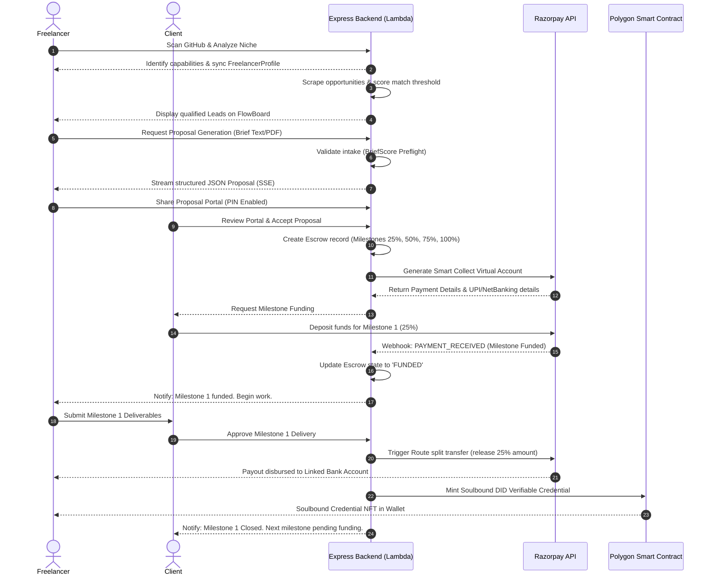

# FixFlowAI - System Design & Architecture Document

This document details the requirements, core flows, database schema design, and high-level architecture diagrams for **FixFlowAI**.

---

## 📋 Tasklist Progress

- [x] **FixFlow AI:** Requirements + key flows
- [x] **FixFlow DB design:** Identify entities + relationships schema level views
- [x] **FixFlow AI:** High-level system design (Mermaid diagrams)

---

## 🧠 1. FixFlow AI: Requirements & Key Flows

### A. Functional Requirements
1. **GitHub Niche Scanner & Developer Profile Mapping:**
   * Scan developer repositories, language weights, commit activity, and active PRs.
   * Auto-assign technical niche categories (e.g. AI/ML, Blockchain, Frontend, Systems) and calculate a niche capability depth score.
2. **Scraped Leads Pipeline (FlowBoard):**
   * Aggregate freelance opportunities across multiple platforms (Upwork, Reddit, Hacker News, direct submissions) using Tavily/SerpAPI/Apify.
   * Cross-reference client requirements with the developer's GitHub profile to score lead matching suitability.
3. **Structured Proposal Workspace:**
   * Accept raw text briefs or PDF/DOCX file uploads.
   * Parse brief quality via BriefScore preflight (gates requirements, timeline, budget).
   * Stream a structured JSON proposal document using SSE (Server-Sent Events) containing features, estimations, risks, timeline, and market research.
4. **Client Sharing & Telemetry Portal:**
   * Generate tokenized portal links with optional PIN-gate security and automatic expiration.
   * Monitor client interaction (dwell time and scroll views per section) to report interest telemetry back to the freelancer.
5. **Autonomous Milestone Escrow Payments:**
   * **Fiat Gateway:** Hold payments securely using Razorpay Smart Collect Virtual Accounts & Route API. Automatically split-payout funds when milestones (25%, 50%, 75%, 100%) are completed.
   * **Web3 Web3 Escrow:** Secure milestone holdings on the Polygon Blockchain in USDC. Mint a Soulbound verifiable credential DID NFT upon project completion.

---

### B. Core System Flows

#### Flow 1: Lead Discovery, Scoring & Outreach
1. **Discover:** The Lead Aggregator runs a cron trigger invoking Apify / Tavily searches.
2. **Save:** New raw opportunities are saved into the `Leads` table with a status of `new`.
3. **Score:** The matching engine compares the lead description against the `FreelancerProfile.githubScan` metadata.
4. **Qualify:** If the score exceeds the `BID_MATCH_THRESHOLD` (e.g., 70%), the lead is moved to the `qualified` status in the Kanban board.
5. **Outreach:** The AI model drafts a contextual email/message matching the user's profile and save it under `Lead.draftMessage`.

#### Flow 2: Autonomous Escrow Payment (Razorpay Route & Smart Collect)
1. **Initiate:** Once the client accepts the proposal, the system creates an `Escrow` record linked to the `Lead`.
2. **Milestones:** Milestones are generated based on the proposal timeline (e.g., 4 milestones at 25% price each).
3. **Deposit:** The client receives a Razorpay Smart Collect link. The payment goes into a designated Virtual Account.
4. **Lock:** The transaction status is updated to `FUNDED`, and notifications alert the freelancer to start working.
5. **Submit & Approve:** The freelancer submits work. The client marks the milestone as `APPROVED`.
6. **Payout Route:** The system triggers a Razorpay Route transfer, releasing the specific milestone percentage (e.g., 25% of the total amount) to the freelancer's bank account, keeping the remaining funds locked.
7. **Complete & DID:** When the final milestone reaches 100%, the funds are fully disbursed, and a Soulbound Verifiable Credential DID is minted.

---

## 🗄️ 2. FixFlow DB Design: Entities & Schema-Level Views

Since FixFlowAI is optimized for cost and scalability using **AWS DynamoDB**, our database schemas are modeled as clean document structures.

```
                  ENTITY RELATIONSHIP LOGICAL SCHEMA
 ┌──────────────┐          ┌──────────────┐          ┌───────────────────┐
 │     User     │1       1│  Freelancer  │1       * │    Credential     │
 │  (Auth & RP) ├─────────┤   Profile    ├──────────┤ (Soulbound proof) │
 └──────┬───────┘         └──────┬───────┘          └───────────────────┘
        │1                       │1
        │                        │
        │*                       │*
 ┌──────┴───────┐          ┌─────┴────────┐
 │  Workspace   │1       * │     Lead     │
 │ (Team context)├─────────┤ (Opp & pipeline)
 └──────┬───────┘          └─────┬────────┘
        │1                       │1
        │                        │
        │*                       │1
 ┌──────┴───────┐          ┌─────┴────────┐
 │   Proposal   │1       1 │    Escrow    │
 │ (JSON / S3)  ├─────────┤ (Razorpay/Web3)
 └──────────────┘          └─────┬────────┘
                                 │1
                                 │
                                 │*
                           ┌─────┴────────┐
                           │   Invoice    │
                           │(Milestone records)
                           └──────────────┘
```

### Table 1: Users
* **Primary Key (`_id`):** UUID String
* **Attributes:**
  * `email` (String) - Unique user email.
  * `passwordHash` (String) - Encrypted password.
  * `role` (Enum) - `'freelancer' | 'client' | 'developer'`.
  * `selectedPlan` (Enum) - `'free' | 'solo' | 'pro' | 'agency'`.
  * `defaultEntryMode` (Enum) - `'individual' | 'team'`.
  * `currentWorkspaceId` (UUID) - Active workspace link.
  * `notificationPreferences` (Map) - Enable flags and channel preferences.
  * `proposalsThisMonth` (Number) - Rate-limiting counter.
  * `stripeCustomerId` (String) - Platform billing customer link.
  * `subscriptionStatus` (String) - active/past-due/none.

### Table 2: FreelancerProfiles
* **Primary Key (`_id`):** UUID String (matches User ID)
* **Attributes:**
  * `did` (String) - Decentralized Identifier.
  * `walletAddresses` (Map) - Web3 addresses: `fixflow` (native), `usdc` (stablecoin), `matic` (gas).
  * `profiles` (Map) - Headlines & descriptions for `upwork`, `linkedin`, and `personal` feeds.
  * `agentConfig` (Map) - Automation toggles: `leadHunter`, `outreachWriter`, `escrowWatcher`, `credentialMinter` (Booleans).
  * `githubScan` (Map) - List of repos, languages, commit counts, and last scanned date.
  * `onboardedAt` (ISO Date) - Profile completion timestamp.

### Table 3: Workspaces
* **Primary Key (`_id`):** UUID String
* **Attributes:**
  * `name` (String) - Team / Organization name.
  * `plan` (Enum) - `'free' | 'pro' | 'agency' | 'scale'`.
  * `notificationDefaults` (Map) - Standard notification settings for members.
  * `slack` (Map) - Integration status, team name, and webhook details.
  * `members` (List of Maps) - User IDs, roles, and joined dates.
  * `invitePending` (List of Maps) - Pending invite email tokens.

### Table 4: Leads
* **Primary Key (`_id`):** UUID String
* **Attributes:**
  * `userId` (UUID) - Freelancer owner.
  * `status` (Enum) - `'new' | 'qualified' | 'contacted' | 'replied' | 'won' | 'lost'`.
  * `score` (Number) - Match score against GitHub profile.
  * `source` (String) - Reddit/Upwork/HN/Tavily/etc.
  * `sourceUrl` (String) - Link to original post.
  * `projectDescription` (String) - Client requirements.
  * `budget` (Map) - Amount, rate type, currency.
  * `match` (Map) - SkillsMatched (array), skillsMissing (array), githubEvidence (array), rationale (array).
  * `bid` (Map) - Status (`not_ready` / `submitted`), draft proposal, submission dates.
  * `company` (Map) - Name, stack, size, mission.
  * `draftMessage` (Map) - Subject, body, tone, wordCount.

### Table 5: Proposals
* **Primary Key (`_id`):** UUID String
* **Attributes:**
  * `s3Key` (String) - Path to versioned proposal JSON in AWS S3.
  * `projectSummary` (String) - Brief outline.
  * `status` (Enum) - `'generating' | 'ready' | 'failed'`.
  * `strategy` (Enum) - `'lean' | 'standard' | 'premium'`.
  * `workspaceId` (UUID) - Project context.
  * `createdBy` (UUID) - Initiating freelancer/agent.
  * `dealStatus` (Enum) - `'pending' | 'negotiating' | 'won' | 'lost'`.
  * `briefScore` (Map) - Scope score, technical score, timeline score.
  * `versionCount` (Number) - Incrementing counter for revisions.
  * `chatTimingStats` (Map) - Interaction delays.
  * `comments` (List of Maps) - Review discussions per section.

### Table 6: Escrows
* **Primary Key (`_id`):** UUID String
* **Attributes:**
  * `leadId` (UUID) - Lead proposal source.
  * `clientDid` (String) - Client ID link.
  * `freelancerDid` (String) - Freelancer ID link.
  * `buyerAddress` (String) - Client payment source.
  * `sellerAddress` (String) - Freelancer payout target.
  * `state` (Enum) - `'CREATED' | 'FUNDED' | 'RELEASED' | 'DISPUTED'`.
  * `totalAmount` (Number) - Budget locked.
  * `currency` (String) - USDC / INR.
  * `milestones` (List of Maps) - Milestone ID, percentage, title, funded status, release status.
  * `razorpayPaymentId` (String) - Reference for transaction audits.
  * `contractAddress` (String) - Polygon smart contract address (if Web3).
  * `chain` (String) - Polygon Amoy/Mainnet.

---

## 🎨 3. FixFlow AI: High-Level System Design

### A. High-Level Architecture Map
The following diagram maps out how a user interacts with the frontend SPA, API Backend hosted on AWS Lambda, DynamoDB, S3, and external systems like Razorpay and Gemini.

```mermaid
graph TD
    %% Define Classes & Styles
    classDef client fill:#3b82f6,stroke:#1d4ed8,stroke-width:2px,color:#fff;
    classDef edge fill:#64748b,stroke:#475569,stroke-width:2px,color:#fff;
    classDef compute fill:#eab308,stroke:#ca8a04,stroke-width:2px,color:#000;
    classDef storage fill:#22c55e,stroke:#16a34a,stroke-width:2px,color:#fff;
    classDef external fill:#a855f7,stroke:#9333ea,stroke-width:2px,color:#fff;

    %% Elements
    ClientBrowser["Browser client (React + Zustand)"]:::client
    CloudFront["AWS CloudFront (CDN)"]:::edge
    S3Static["S3 Bucket (Static Assets)"]:::storage
    LambdaBackend["AWS Lambda API (via Function URL)"]:::compute
    DynamoDB["Amazon DynamoDB (On-Demand DB)"]:::storage
    S3Data["S3 Bucket (Proposal Revisions & PDFs)"]:::storage
    
    GeminiAPI["Google Gemini AI API"]:::external
    RazorpayGateway["Razorpay Escrow API"]:::external
    PolygonChain["Polygon Blockchain"]:::external

    %% Flow Connections
    ClientBrowser -->|1. Requests static UI| CloudFront
    CloudFront -->|2. Pulls| S3Static
    ClientBrowser -->|3. Direct API requests & SSE streams (Function URL)| LambdaBackend
    LambdaBackend -->|4. Queries database| DynamoDB
    LambdaBackend -->|5. Saves proposal versions| S3Data
    
    LambdaBackend -->|6. Fetches structured prompts| GeminiAPI
    LambdaBackend -->|7. Holds/routes milestone payouts| RazorpayGateway
    LambdaBackend -->|8. Mints verifiable Soulbound DID credentials| PolygonChain
```

---

### B. End-to-End Proposal & Milestone Payment Sequence Flow
This sequence chart details the interaction between the Freelancer, Client, the API Backend, Razorpay, and the Polygon contract.


